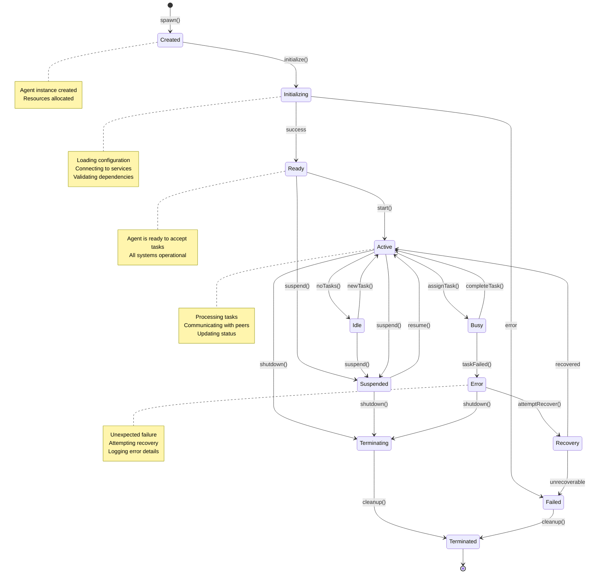
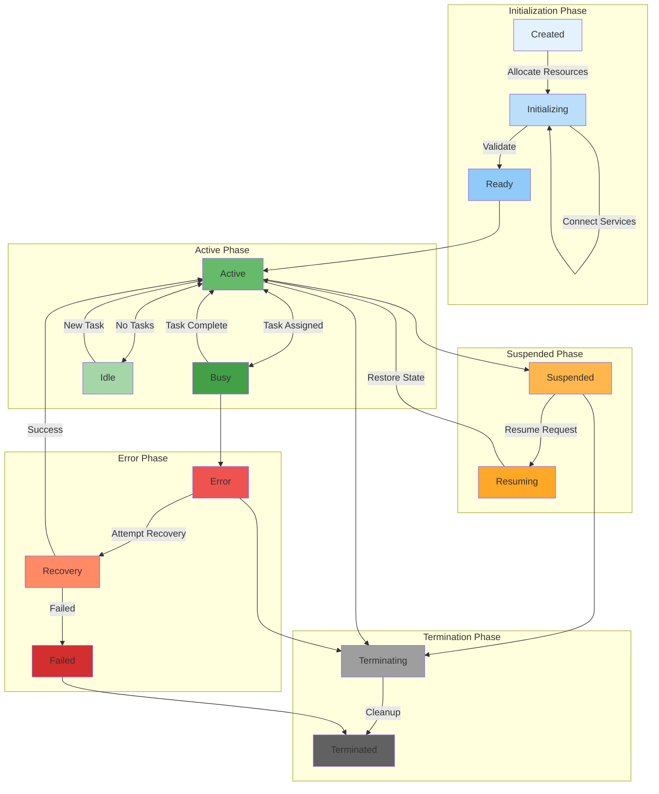
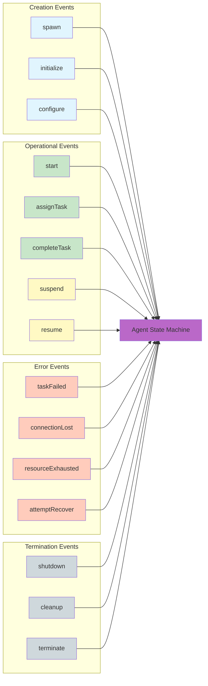
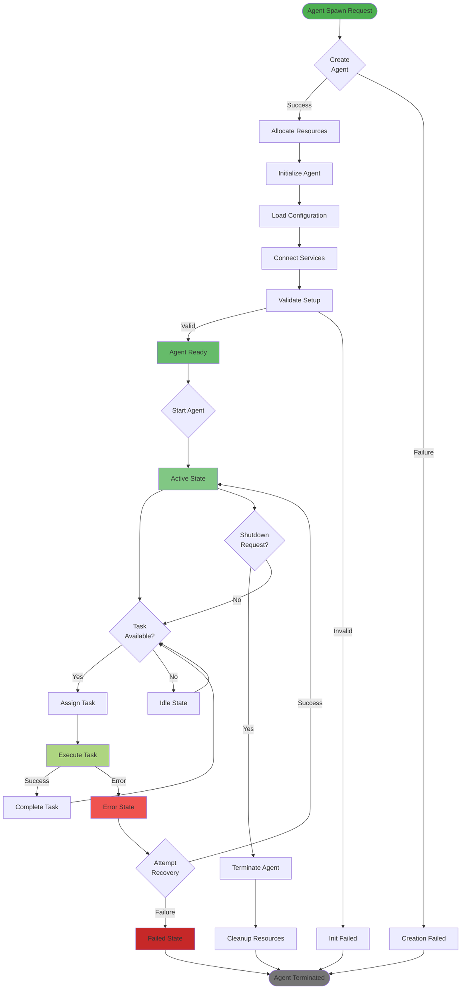
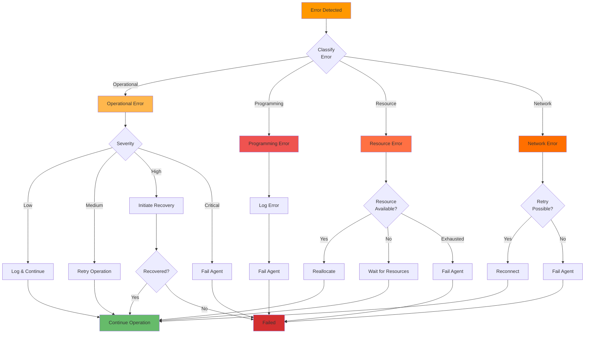
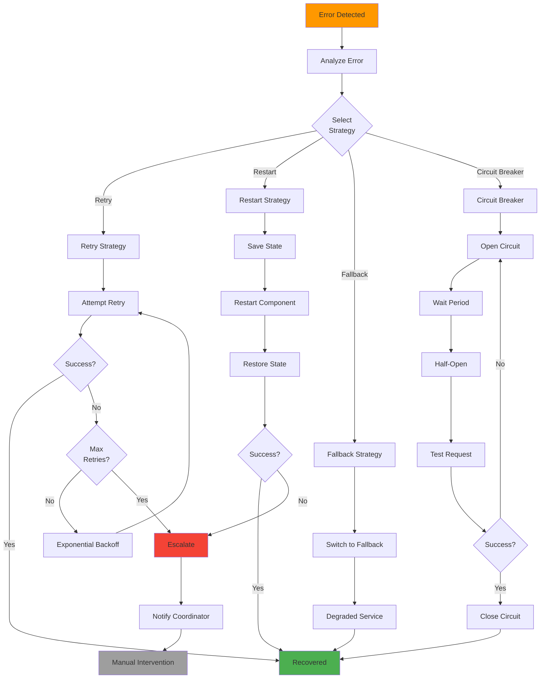
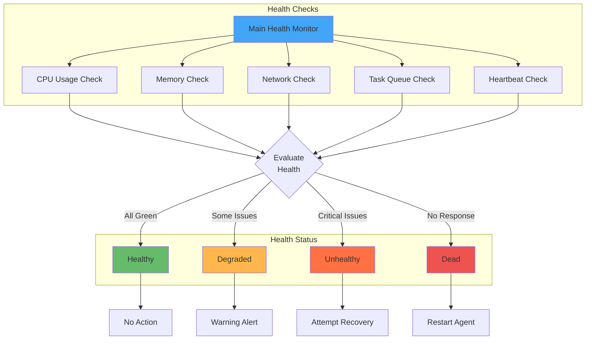
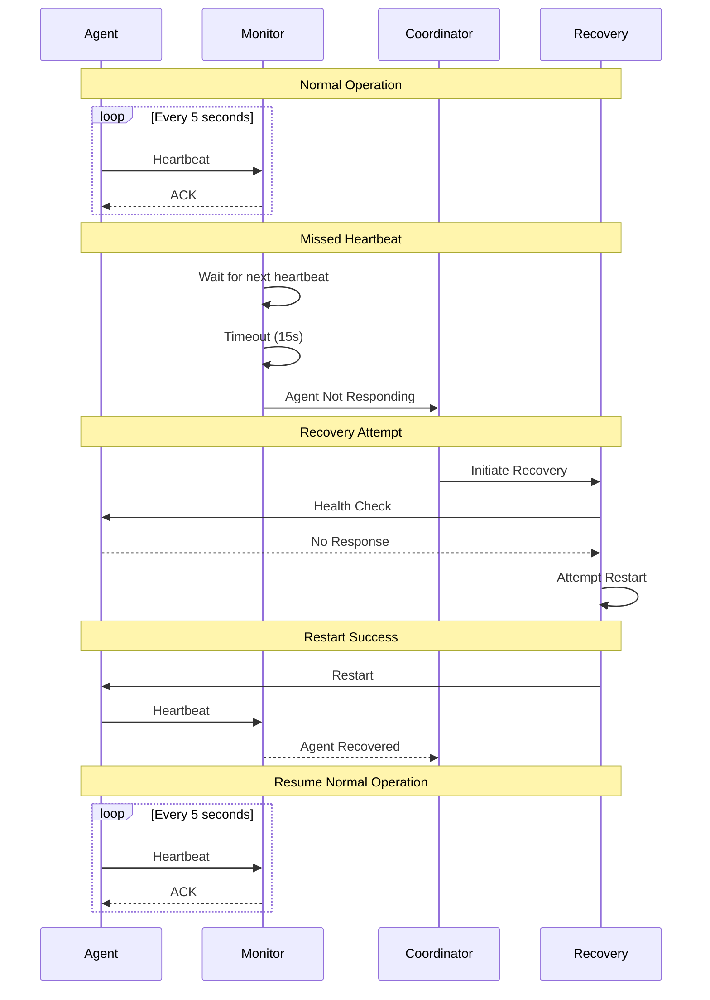
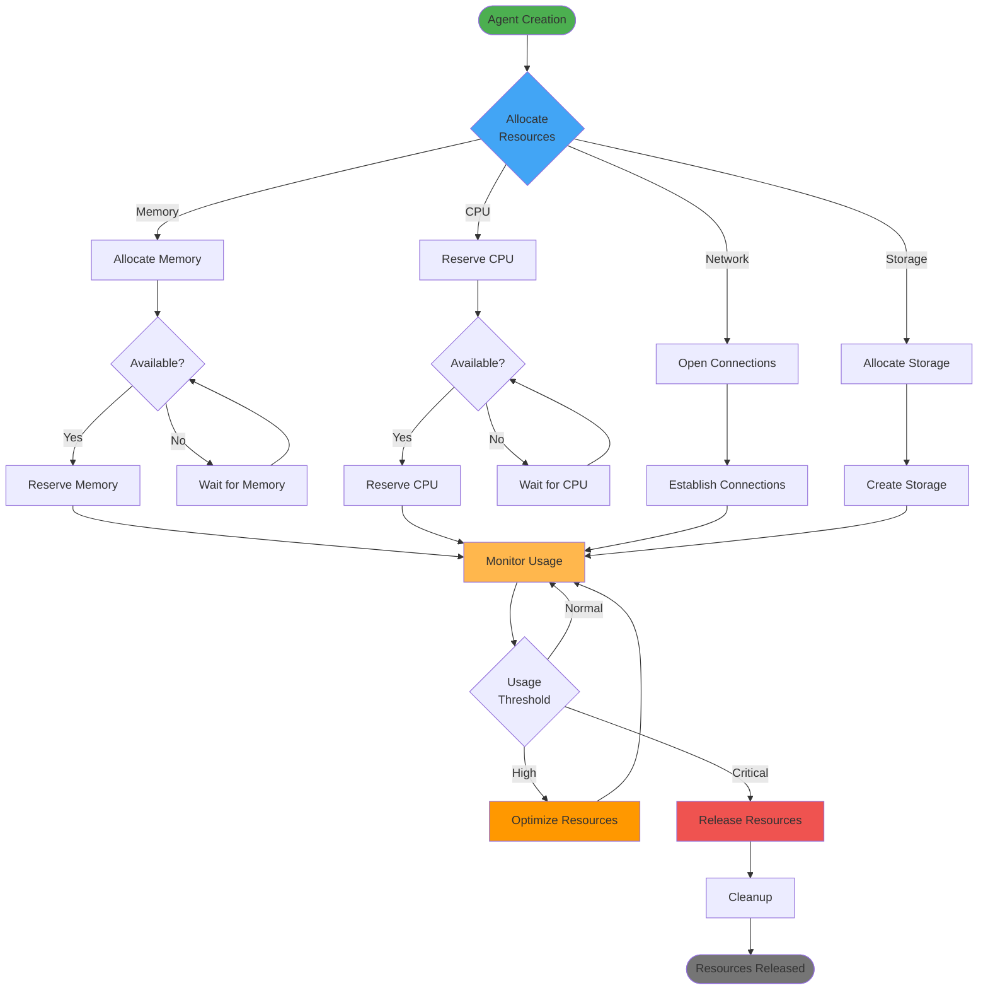
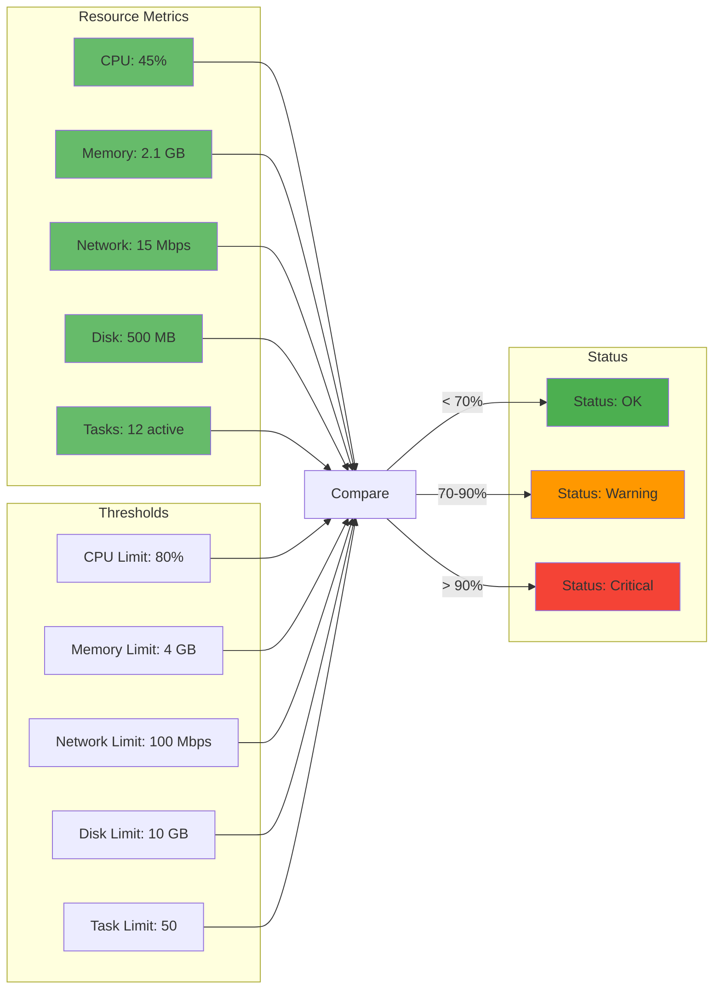

# Agent Lifecycle

Comprehensive diagrams showing agent states, transitions, error handling, and recovery flows.

## Table of Contents

1. [Agent State Machine](#agent-state-machine)
2. [Lifecycle States](#lifecycle-states)
3. [State Transitions](#state-transitions)
4. [Error States and Recovery](#error-states-and-recovery)
5. [Health Monitoring](#health-monitoring)
6. [Resource Management](#resource-management)

---

## Agent State Machine

### Complete State Diagram

---

## Lifecycle States

### State Details

---

## State Transitions

### Transition Events

### Detailed Transition Flow

---

## Error States and Recovery

### Error Classification

### Recovery Strategies

---

## Health Monitoring

### Health Check System

### Heartbeat Flow

---

## Resource Management

### Resource Lifecycle

### Resource Monitoring Dashboard

---

## Related Documentation

- [System Architecture](./SYSTEM_ARCHITECTURE.md) - Overall system design
- [Swarm Coordination](./SWARM_COORDINATION.md) - Multi-agent coordination
- [Error Handling](./ERROR_HANDLING.md) - Comprehensive error flows
- [Sequences](./SEQUENCES.md) - Detailed sequence diagrams
- [Deployment](./DEPLOYMENT.md) - Infrastructure and scaling

---

**Last Updated**: 2025-12-08
**Diagram Count**: 10 interactive Mermaid.js diagrams
