# Data Flow Architecture

Comprehensive diagrams showing request/response flows, memory operations, vector search, and learning cycles.

## Table of Contents

1. [Request/Response Flows](#requestresponse-flows)
2. [Memory Operations](#memory-operations)
3. [Vector Search Pipeline](#vector-search-pipeline)
4. [Learning Cycle](#learning-cycle)
5. [Data Synchronization](#data-synchronization)
6. [Caching Strategy](#caching-strategy)

---

## Request/Response Flows

### HTTP Request Flow

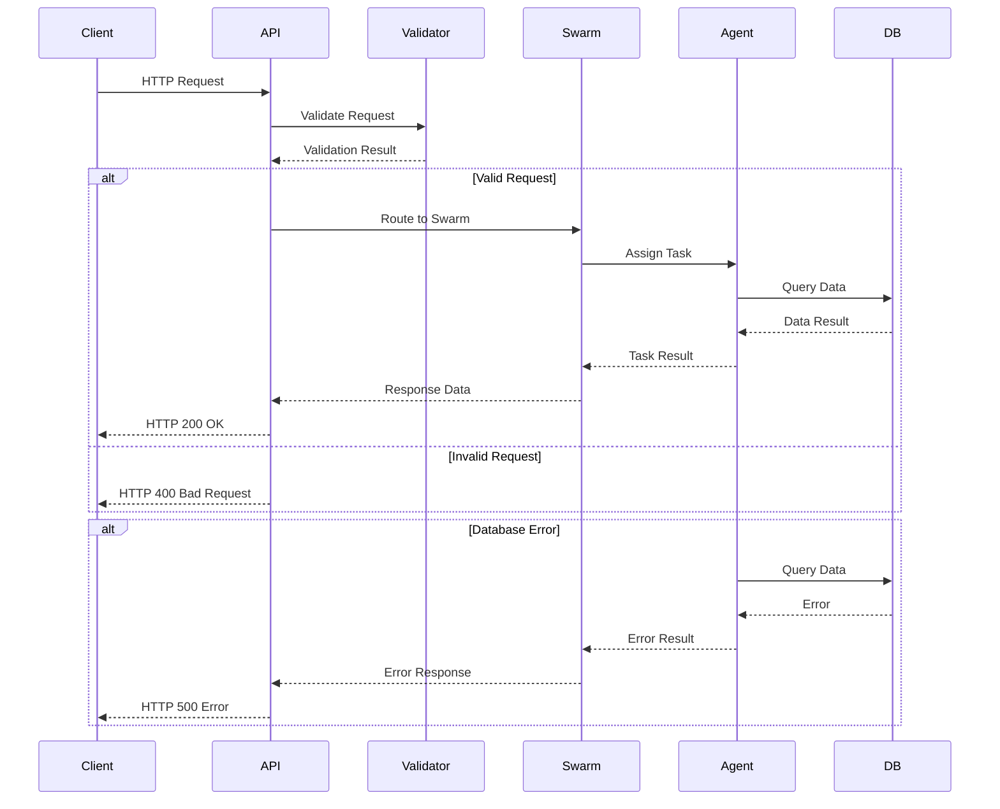

### Task Execution Flow

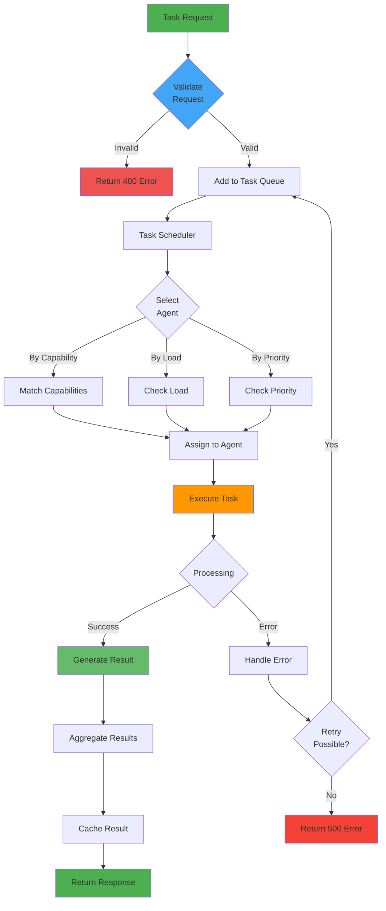

---

## Memory Operations

### Memory Write Flow

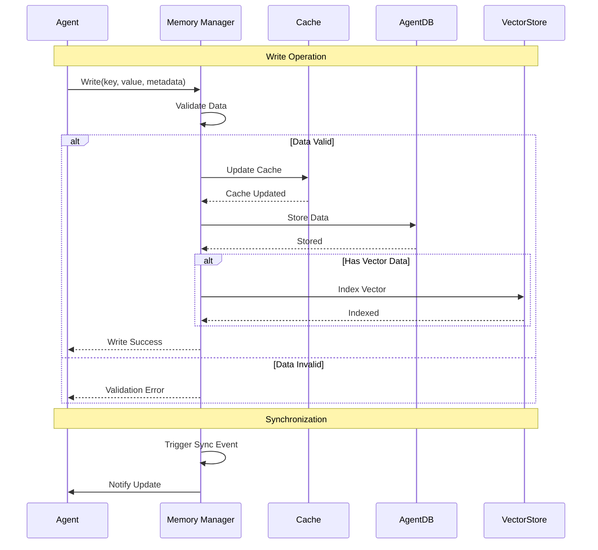

### Memory Read Flow

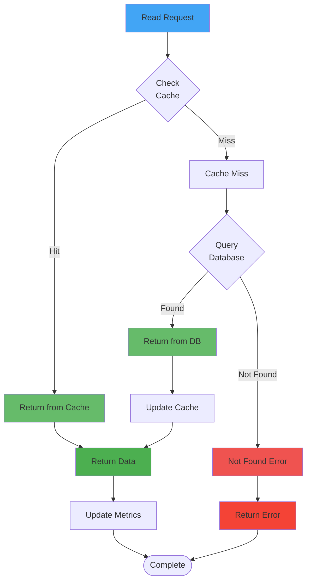

---

## Vector Search Pipeline

### Vector Embedding and Search

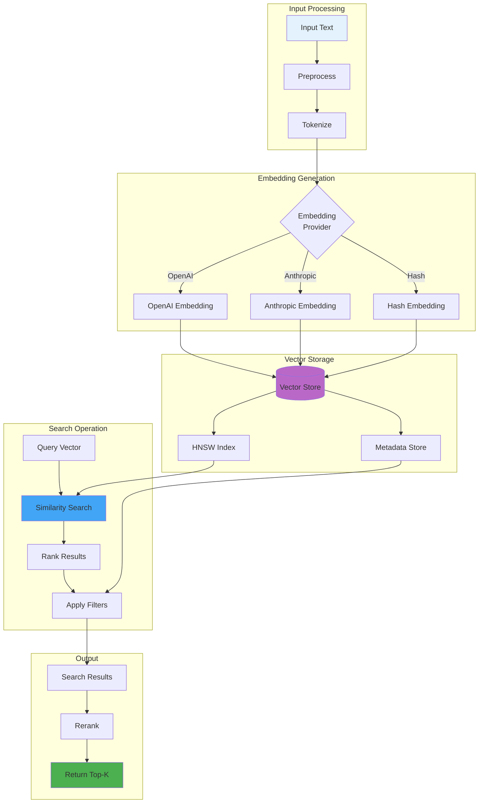

### Search Performance Flow

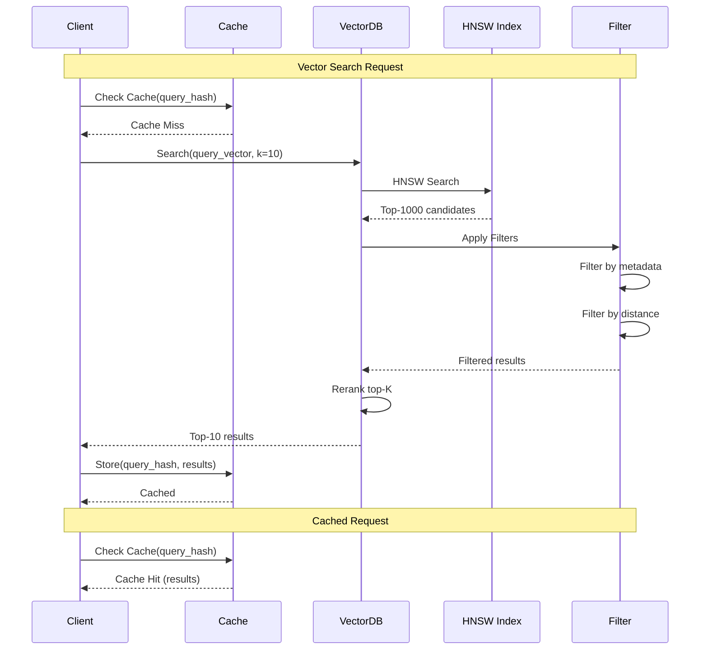

---

## Learning Cycle

### ReasoningBank Learning Flow

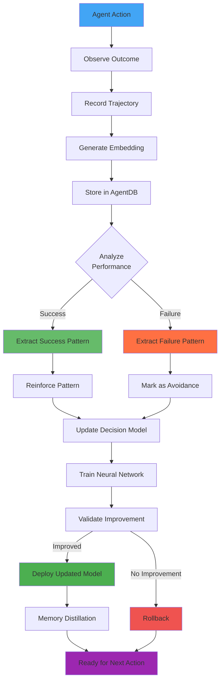

### Verdict Judgment Process

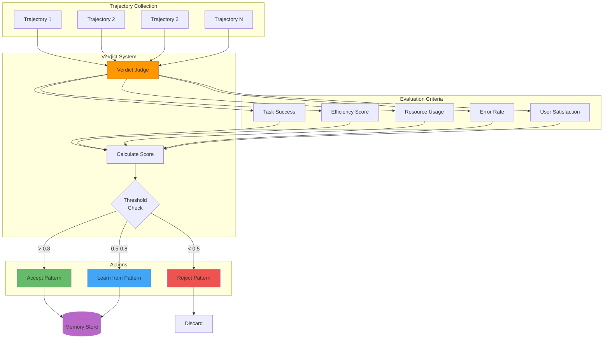

---

## Data Synchronization

### Multi-Agent Memory Sync

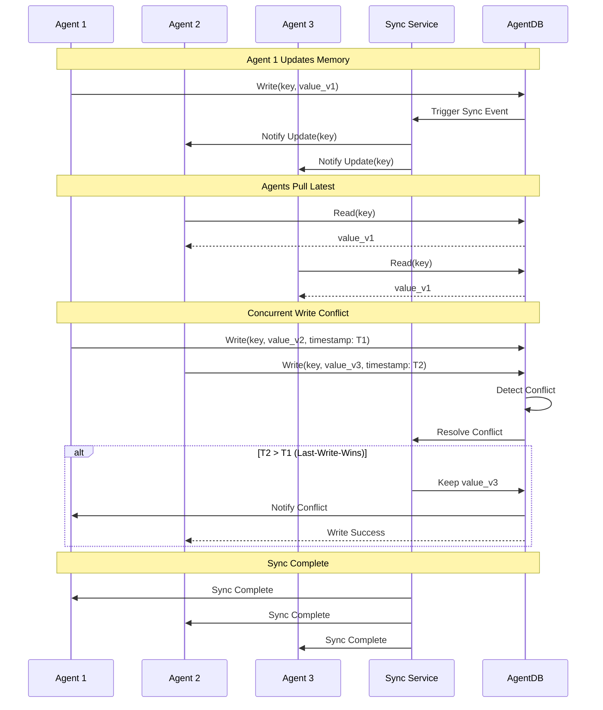

### QUIC Transport Sync

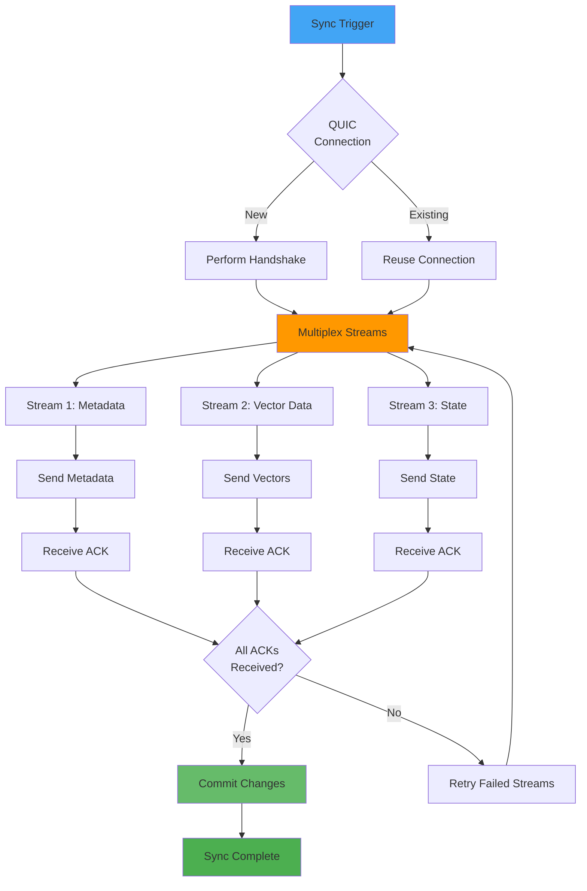

---

## Caching Strategy

### Multi-Level Cache

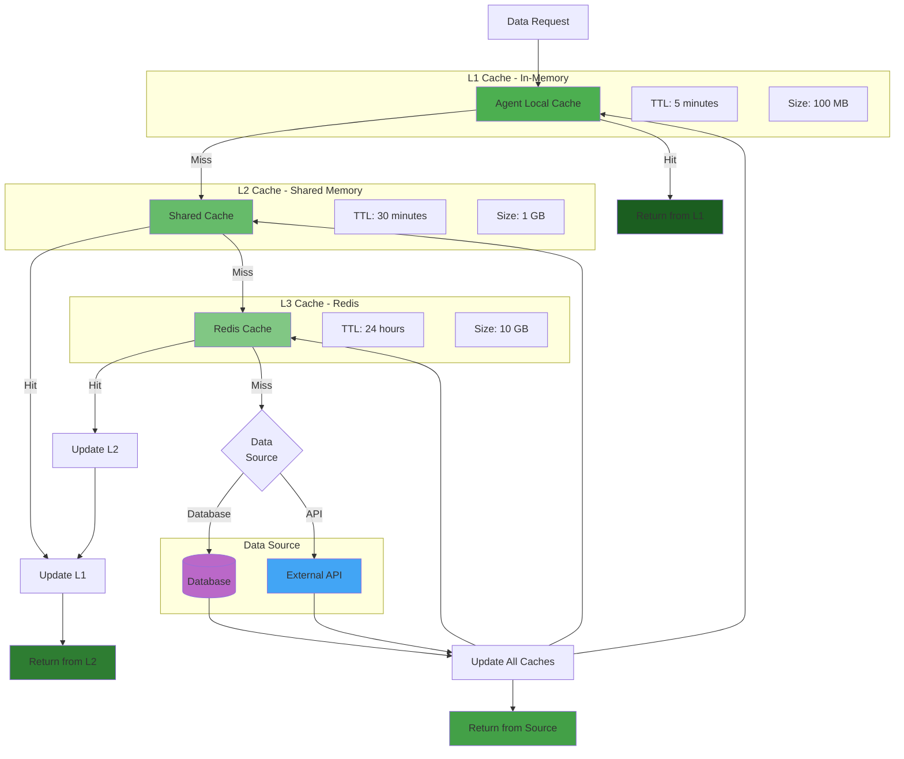

### Cache Invalidation

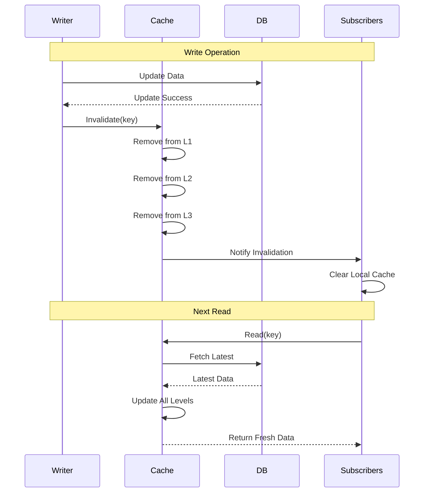

---

## Related Documentation

- [System Architecture](./SYSTEM_ARCHITECTURE.md) - Overall system design
- [Swarm Coordination](./SWARM_COORDINATION.md) - Multi-agent coordination
- [Agent Lifecycle](./AGENT_LIFECYCLE.md) - Agent state management
- [Sequences](./SEQUENCES.md) - Detailed sequence diagrams
- [Security](./SECURITY.md) - Data encryption and security

---

**Last Updated**: 2025-12-08
**Diagram Count**: 11 interactive Mermaid.js diagrams
