# Deployment Architecture

Infrastructure diagrams showing deployment patterns, scaling strategies, and high availability configurations.

## Table of Contents

1. [Infrastructure Overview](#infrastructure-overview)
2. [Container Architecture](#container-architecture)
3. [Scaling Patterns](#scaling-patterns)
4. [High Availability](#high-availability)
5. [Monitoring and Observability](#monitoring-and-observability)
6. [Disaster Recovery](#disaster-recovery)

---

## Infrastructure Overview

### Production Deployment

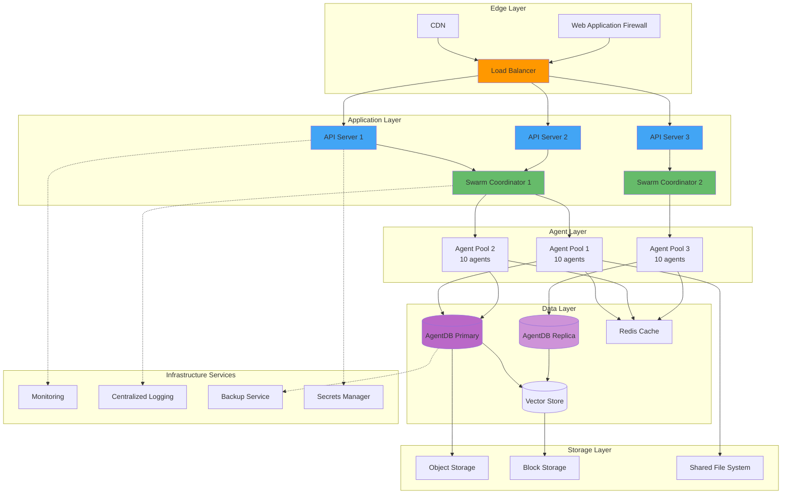

---

## Container Architecture

### Docker Deployment

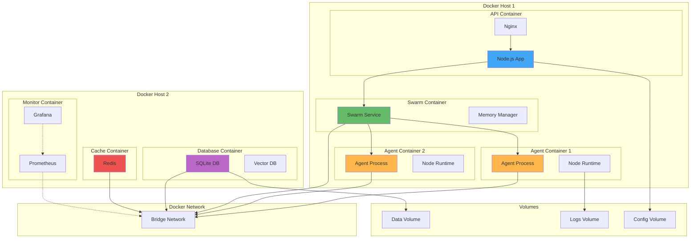

### Kubernetes Deployment

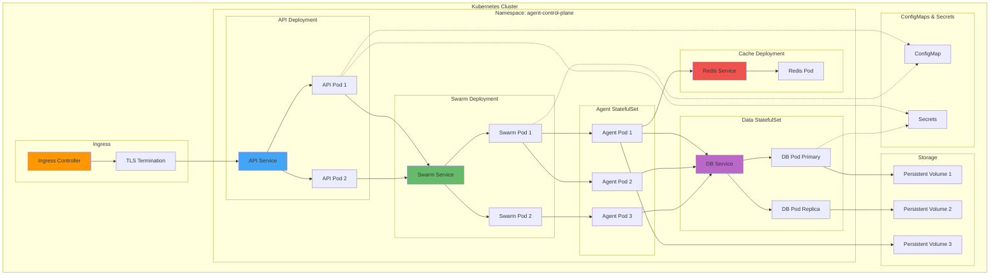

---

## Scaling Patterns

### Horizontal Scaling

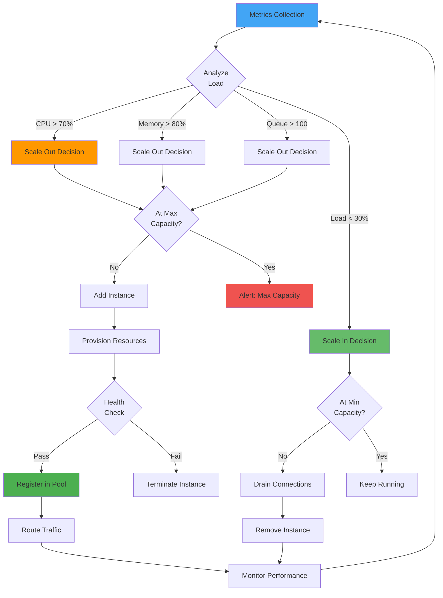

### Auto-Scaling Configuration

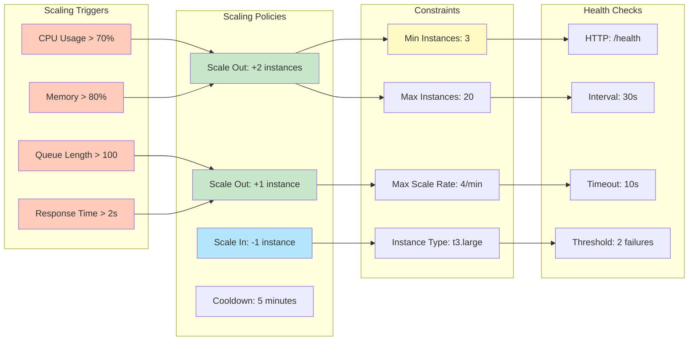

---

## High Availability

### Active-Active Configuration

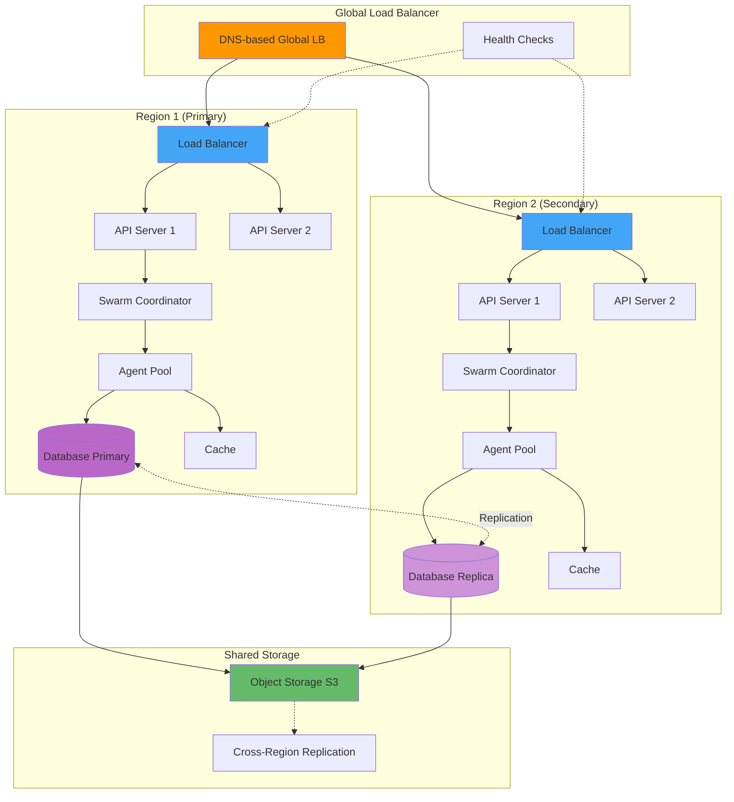

### Failover Strategy

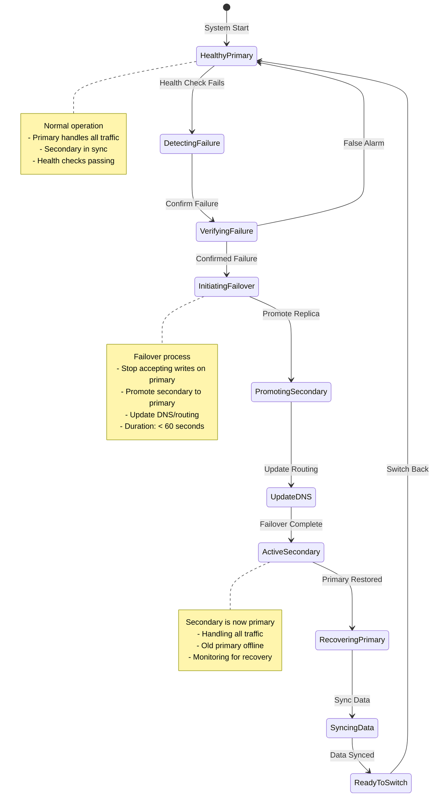

---

## Monitoring and Observability

### Monitoring Stack

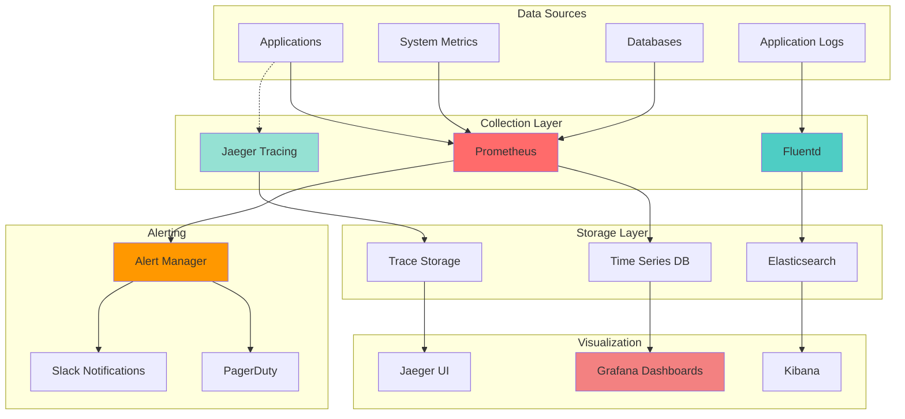

### Observability Dashboard

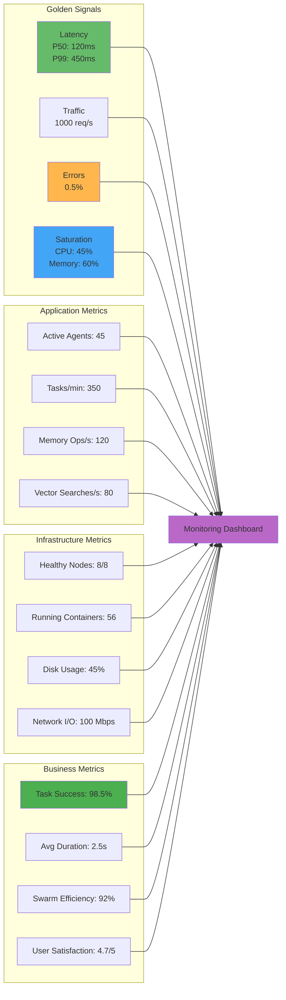

---

## Disaster Recovery

### Backup Strategy

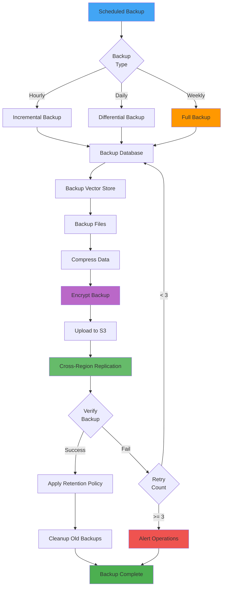

### Recovery Process

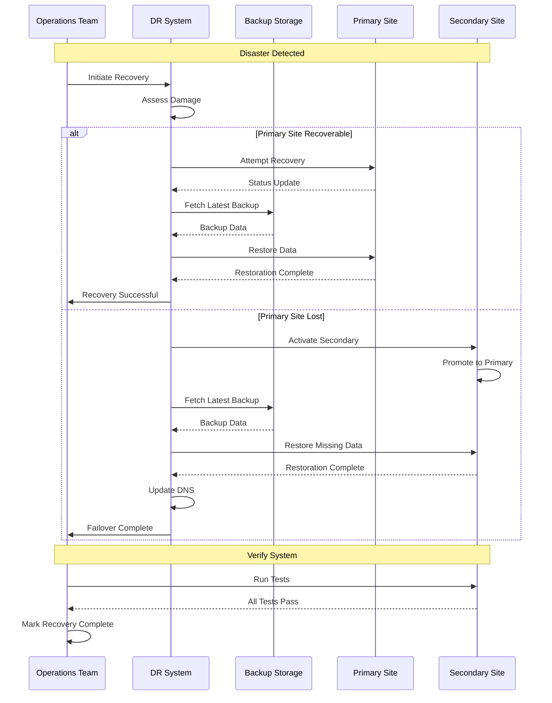

---

## Related Documentation

- [System Architecture](./SYSTEM_ARCHITECTURE.md) - Overall system design
- [Swarm Coordination](./SWARM_COORDINATION.md) - Multi-agent coordination
- [Security](./SECURITY.md) - Security architecture
- [Sequences](./SEQUENCES.md) - Detailed workflows
- [Data Flow](./DATA_FLOW.md) - Data movement patterns

---

**Last Updated**: 2025-12-08
**Diagram Count**: 10 interactive Mermaid.js diagrams
