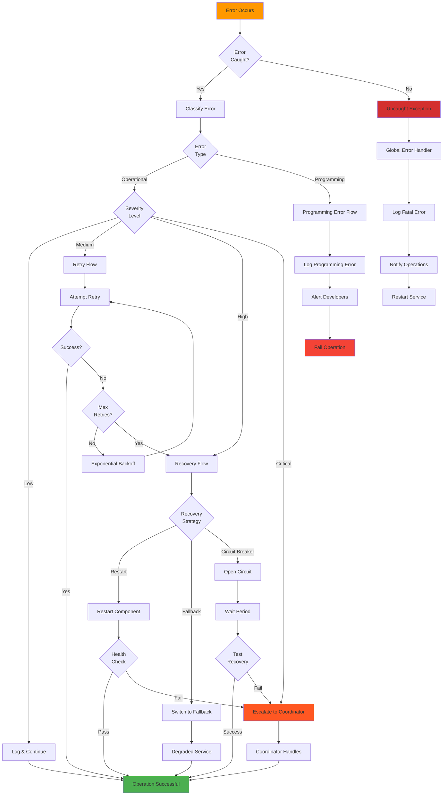
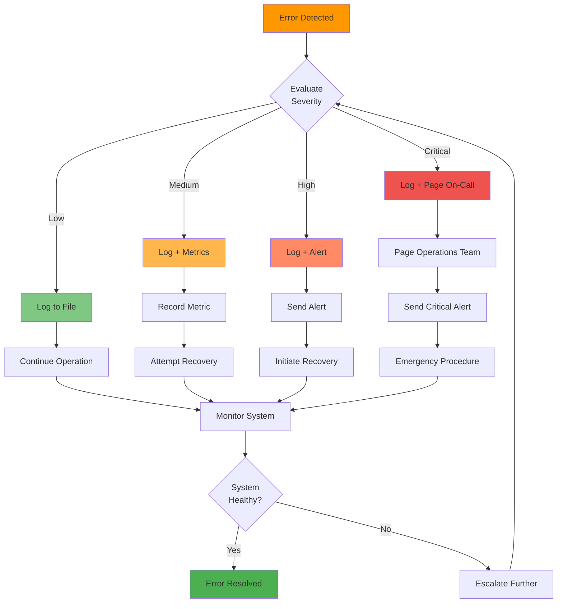
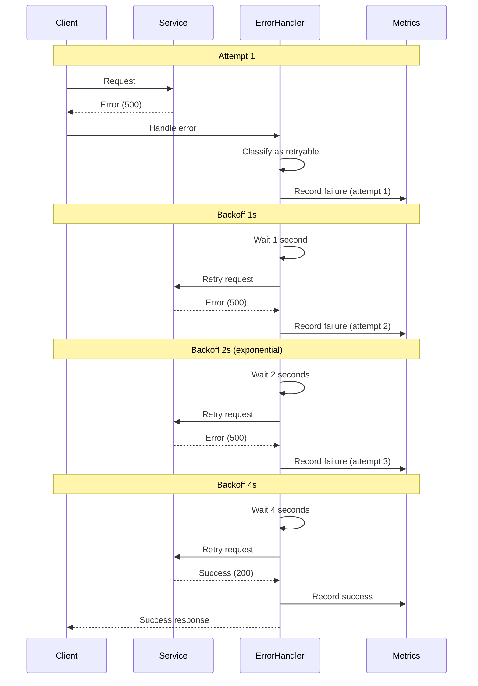
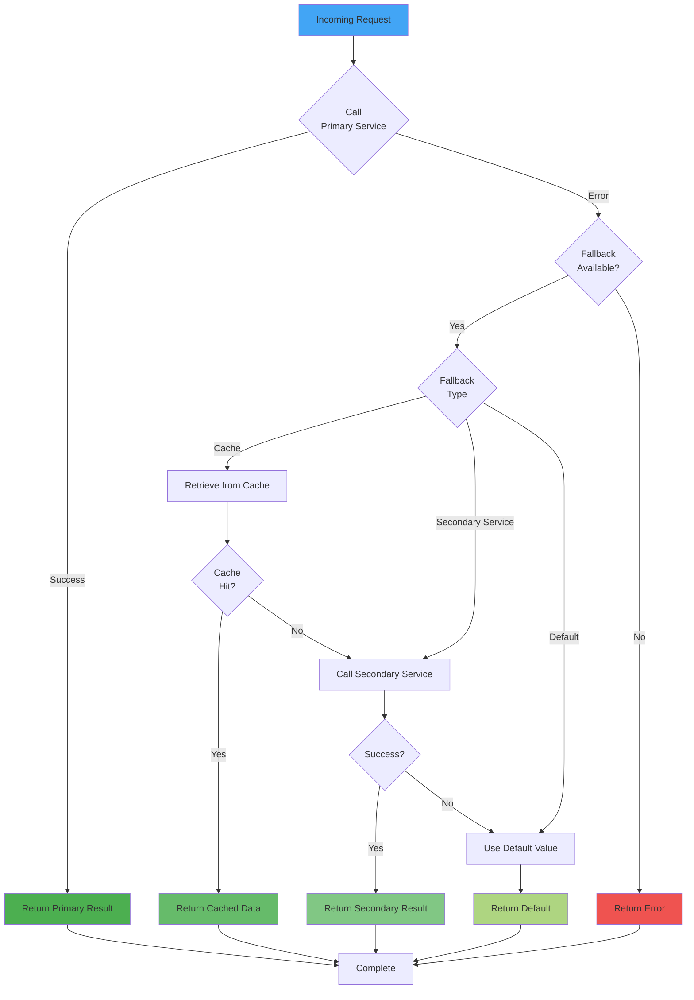
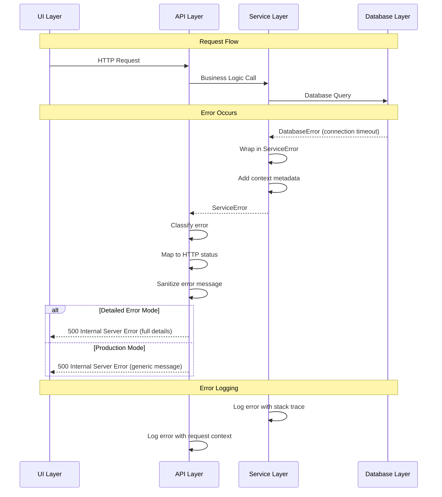
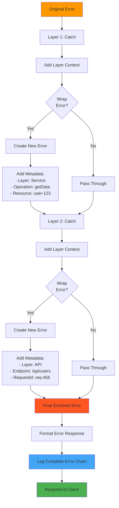
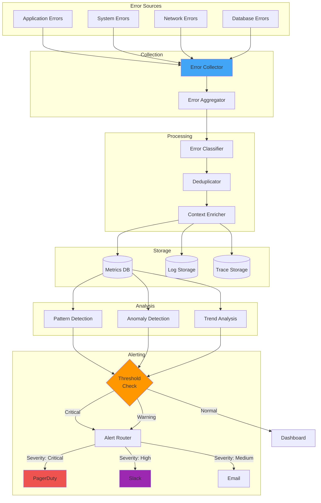
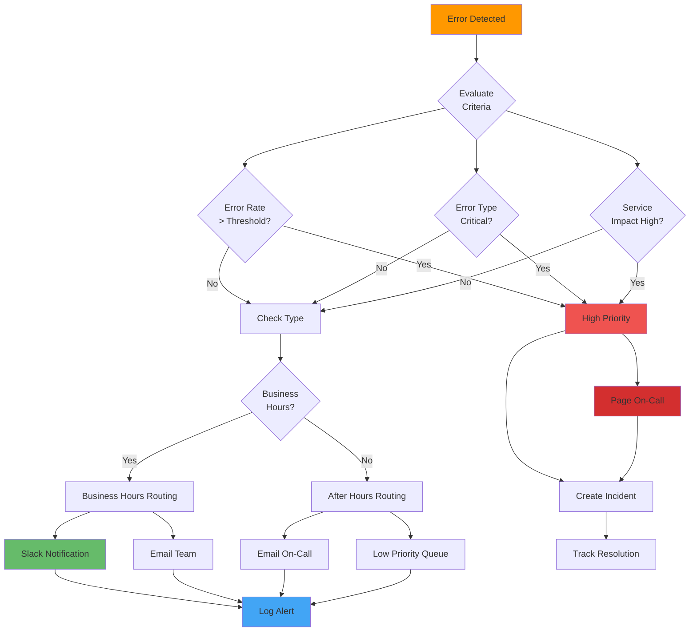
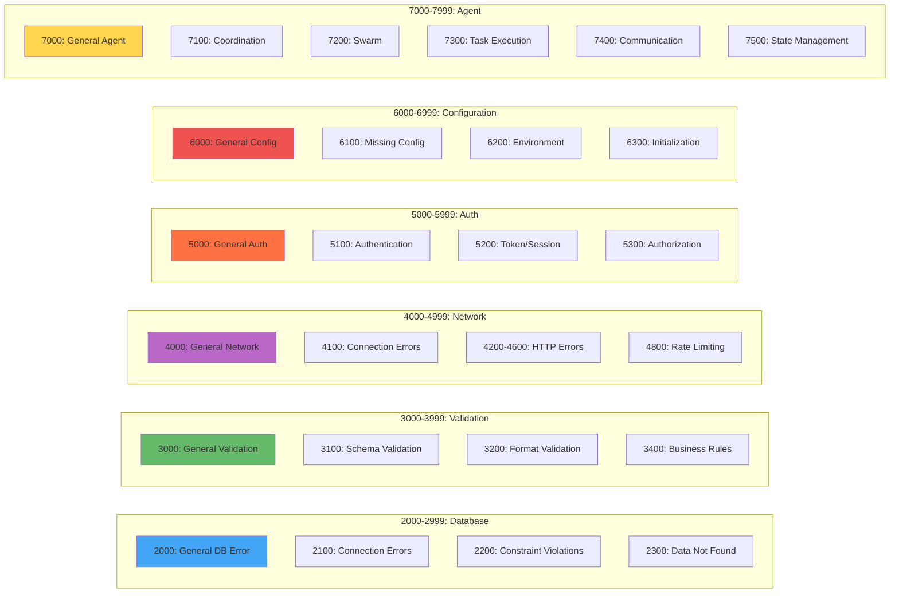

# Error Handling Architecture

Comprehensive error flow diagrams showing error classification, propagation, recovery strategies, and monitoring.

## Table of Contents

1. [Error Hierarchy](#error-hierarchy)
2. [Error Flow Patterns](#error-flow-patterns)
3. [Error Recovery Strategies](#error-recovery-strategies)
4. [Error Propagation](#error-propagation)
5. [Monitoring and Alerting](#monitoring-and-alerting)
6. [Error Code Ranges](#error-code-ranges)

---

## Error Hierarchy

### Error Classification Tree

```mermaid
graph TB
    ERROR[Error]

    ERROR --> OPERATIONAL[Operational Error<br/>Expected & Recoverable]
    ERROR --> PROGRAMMING[Programming Error<br/>Bugs & Critical Issues]

    OPERATIONAL --> DATABASE[Database Errors<br/>2000-2999]
    OPERATIONAL --> VALIDATION[Validation Errors<br/>3000-3999]
    OPERATIONAL --> NETWORK[Network Errors<br/>4000-4999]
    OPERATIONAL --> AUTH[Authentication/Authorization<br/>5000-5999]
    OPERATIONAL --> AGENT[Agent Errors<br/>7000-7999]

    PROGRAMMING --> CONFIG[Configuration Errors<br/>6000-6999]

    DATABASE --> DB_CONN[Connection Timeout<br/>DB_2100]
    DATABASE --> DB_QUERY[Query Timeout<br/>DB_2110]
    DATABASE --> DB_CONSTRAINT[Constraint Violation<br/>DB_2200]
    DATABASE --> DB_NOT_FOUND[Data Not Found<br/>DB_2300]

    VALIDATION --> VAL_REQUIRED[Missing Required Field<br/>VAL_3100]
    VALIDATION --> VAL_TYPE[Type Validation<br/>VAL_3110]
    VALIDATION --> VAL_RANGE[Range Validation<br/>VAL_3120]
    VALIDATION --> VAL_BUSINESS[Business Rule Violation<br/>VAL_3400]

    NETWORK --> NET_CONN[Connection Refused<br/>NET_4100]
    NETWORK --> NET_TIMEOUT[Request Timeout<br/>NET_4110]
    NETWORK --> NET_HTTP[HTTP Errors<br/>NET_4200-4600]
    NETWORK --> NET_RATE[Rate Limit<br/>NET_4800]

    AUTH --> AUTH_INVALID[Invalid Credentials<br/>AUTH_5100]
    AUTH --> AUTH_EXPIRED[Token Expired<br/>AUTH_5200]
    AUTH --> AUTH_PERM[Insufficient Permissions<br/>AUTH_5300]

    AGENT --> AGT_NOT_FOUND[Agent Not Found<br/>AGT_7001]
    AGENT --> AGT_TASK[Task Execution Failed<br/>AGT_7302]
    AGENT --> AGT_SWARM[Swarm Capacity Exceeded<br/>AGT_7203]
    AGENT --> AGT_CONSENSUS[Consensus Failed<br/>AGT_7103]

    CONFIG --> CFG_MISSING[Missing Configuration<br/>CFG_6100]
    CONFIG --> CFG_INVALID[Invalid Config Value<br/>CFG_6110]
    CONFIG --> CFG_ENV[Missing Env Variable<br/>CFG_6120]

    style ERROR fill:#ff9800
    style OPERATIONAL fill:#4caf50
    style PROGRAMMING fill:#f44336
    style DATABASE fill:#42a5f5
    style VALIDATION fill:#66bb6a
    style NETWORK fill:#ba68c8
    style AUTH fill:#ff7043
    style AGENT fill:#ffd54f
    style CONFIG fill:#ef5350
```

---

## Error Flow Patterns

### Error Detection and Handling Flow

### Error Severity Escalation

---

## Error Recovery Strategies

### Retry Strategy with Backoff

### Fallback Pattern

---

## Error Propagation

### Error Bubbling Through Layers

### Error Context Enrichment

---

## Monitoring and Alerting

### Error Monitoring Pipeline

### Alert Routing Logic

---

## Error Code Ranges

### Code Range Allocation

---

## Related Documentation

- [System Architecture](./SYSTEM_ARCHITECTURE.md) - Overall system design
- [Agent Lifecycle](./AGENT_LIFECYCLE.md) - Agent error states
- [Sequences](./SEQUENCES.md) - Error handling sequences
- [Deployment](./DEPLOYMENT.md) - Infrastructure monitoring
- [Security](./SECURITY.md) - Security error handling

---

**Last Updated**: 2025-12-08
**Diagram Count**: 10 interactive Mermaid.js diagrams
