# Architecture Documentation

Comprehensive interactive Mermaid.js diagrams visualizing the agent-control-plane system architecture.

## Overview

This documentation provides 79+ interactive Mermaid.js diagrams that visualize every aspect of the agent-control-plane system, from high-level architecture to detailed workflows and security patterns.

## Quick Navigation

### Core Architecture

- **[System Architecture](./SYSTEM_ARCHITECTURE.md)** - 8 diagrams covering overall system design, components, layers, and integrations
- **[Swarm Coordination](./SWARM_COORDINATION.md)** - 11 diagrams showing topology patterns, coordination mechanisms, and consensus
- **[Agent Lifecycle](./AGENT_LIFECYCLE.md)** - 10 diagrams detailing agent states, transitions, and health monitoring

### Data and Communication

- **[Data Flow](./DATA_FLOW.md)** - 11 diagrams illustrating request/response flows, memory operations, and vector search
- **[Sequences](./SEQUENCES.md)** - 10 sequence diagrams showing detailed workflows and interactions

### Infrastructure

- **[Deployment](./DEPLOYMENT.md)** - 10 diagrams covering infrastructure, scaling, high availability, and disaster recovery
- **[Error Handling](./ERROR_HANDLING.md)** - 10 diagrams showing error classification, recovery strategies, and monitoring

### Security

- **[Security](./SECURITY.md)** - 9 diagrams detailing encryption, authentication, authorization, and compliance

---

## Documentation Structure

```mermaid
graph TB
    INDEX[Architecture<br/>Documentation Index]

    INDEX --> SYS[System Architecture<br/>8 diagrams]
    INDEX --> SWARM[Swarm Coordination<br/>11 diagrams]
    INDEX --> AGENT[Agent Lifecycle<br/>10 diagrams]
    INDEX --> DATA[Data Flow<br/>11 diagrams]
    INDEX --> SEQ[Sequences<br/>10 diagrams]
    INDEX --> DEPLOY[Deployment<br/>10 diagrams]
    INDEX --> ERROR[Error Handling<br/>10 diagrams]
    INDEX --> SEC[Security<br/>9 diagrams]

    SYS --> D1[High-Level Overview]
    SYS --> D2[Core Components]
    SYS --> D3[Layer Architecture]
    SYS --> D4[Integration Points]

    SWARM --> D5[Topology Patterns]
    SWARM --> D6[Hierarchical]
    SWARM --> D7[Mesh]
    SWARM --> D8[Adaptive]
    SWARM --> D9[Consensus]

    AGENT --> D10[State Machine]
    AGENT --> D11[Lifecycle States]
    AGENT --> D12[Transitions]
    AGENT --> D13[Error Recovery]
    AGENT --> D14[Health Monitoring]

    DATA --> D15[Request/Response]
    DATA --> D16[Memory Operations]
    DATA --> D17[Vector Search]
    DATA --> D18[Learning Cycle]
    DATA --> D19[Synchronization]

    SEQ --> D20[Agent Creation]
    SEQ --> D21[Task Execution]
    SEQ --> D22[Swarm Coordination]
    SEQ --> D23[Memory Sync]
    SEQ --> D24[Error Handling]

    DEPLOY --> D25[Infrastructure]
    DEPLOY --> D26[Containers]
    DEPLOY --> D27[Scaling]
    DEPLOY --> D28[High Availability]
    DEPLOY --> D29[Monitoring]

    ERROR --> D30[Error Hierarchy]
    ERROR --> D31[Error Flows]
    ERROR --> D32[Recovery]
    ERROR --> D33[Propagation]
    ERROR --> D34[Alerting]

    SEC --> D35[Security Layers]
    SEC --> D36[HIPAA Encryption]
    SEC --> D37[Authentication]
    SEC --> D38[Authorization]
    SEC --> D39[PII Scrubbing]

    style INDEX fill:#ffd54f,stroke:#f57f17,stroke-width:4px
    style SYS fill:#42a5f5
    style SWARM fill:#66bb6a
    style AGENT fill:#ba68c8
    style DATA fill:#ff9800
    style SEQ fill:#26a69a
    style DEPLOY fill:#ef5350
    style ERROR fill:#ff7043
    style SEC fill:#9c27b0
```



---

## Diagram Statistics

| Category                | File                   | Diagram Count | Topics Covered                                                                                                                                        |
| ----------------------- | ---------------------- | ------------- | ----------------------------------------------------------------------------------------------------------------------------------------------------- |
| **System Architecture** | SYSTEM_ARCHITECTURE.md | 8             | System overview, components, layers, integrations, dependencies, module organization, technology stack                                                |
| **Swarm Coordination**  | SWARM_COORDINATION.md  | 11            | Topologies, hierarchical, mesh, adaptive, consensus (Byzantine, Raft), communication, load balancing, metrics                                         |
| **Agent Lifecycle**     | AGENT_LIFECYCLE.md     | 10            | State machine, lifecycle phases, transitions, error states, recovery, health monitoring, resource management                                          |
| **Data Flow**           | DATA_FLOW.md           | 11            | HTTP requests, task execution, memory operations (read/write), vector search, learning cycle, synchronization, caching                                |
| **Sequences**           | SEQUENCES.md           | 10            | Agent creation, task workflows, parallel execution, hierarchical coordination, mesh coordination, memory sync, error recovery, full-stack development |
| **Deployment**          | DEPLOYMENT.md          | 10            | Infrastructure, Docker, Kubernetes, horizontal scaling, high availability, active-active, monitoring stack, disaster recovery, backup                 |
| **Error Handling**      | ERROR_HANDLING.md      | 10            | Error hierarchy, classification, flow patterns, severity, retry strategies, fallback, propagation, monitoring, alerting, code ranges                  |
| **Security**            | SECURITY.md            | 9             | Defense in depth, HIPAA encryption, key management, authentication (MFA), authorization (RBAC), PII scrubbing, security monitoring                    |
| **TOTAL**               | **8 files**            | **79**        | **All system aspects**                                                                                                                                |

---

## Key Diagram Types

### Flowcharts

- Task execution workflows
- Error handling flows
- Decision trees and branching logic
- Recovery procedures

### Sequence Diagrams

- Agent creation and initialization
- Inter-agent communication
- Memory synchronization
- Authentication flows
- Error propagation

### State Diagrams

- Agent lifecycle states
- Failover states
- Circuit breaker states
- Consensus states

### Architecture Diagrams

- System components and layers
- Network topology
- Deployment architecture
- Security architecture

### Graph Diagrams

- Component dependencies
- Error hierarchy
- Permission models
- Data flow patterns

---

## Quick Reference Guide

### For New Developers

Start with these diagrams to understand the system:

1. [System Architecture - High-Level Overview](./SYSTEM_ARCHITECTURE.md#high-level-system-overview)
2. [Agent Lifecycle - State Machine](./AGENT_LIFECYCLE.md#agent-state-machine)
3. [Sequences - Agent Creation Flow](./SEQUENCES.md#agent-creation-flow)

### For Operations Teams

Focus on deployment and monitoring:

1. [Deployment - Infrastructure Overview](./DEPLOYMENT.md#infrastructure-overview)
2. [Deployment - High Availability](./DEPLOYMENT.md#high-availability)
3. [Error Handling - Monitoring Pipeline](./ERROR_HANDLING.md#monitoring-and-alerting)

### For Security Teams

Review security and compliance:

1. [Security - Defense in Depth](./SECURITY.md#security-layers)
2. [Security - HIPAA Encryption](./SECURITY.md#hipaa-encryption)
3. [Security - Authorization Model](./SECURITY.md#authorization-model)

### For Architects

Understand coordination patterns:

1. [Swarm Coordination - Topology Overview](./SWARM_COORDINATION.md#swarm-topologies)
2. [Swarm Coordination - Consensus Mechanisms](./SWARM_COORDINATION.md#consensus-mechanisms)
3. [Data Flow - Vector Search Pipeline](./DATA_FLOW.md#vector-search-pipeline)

---

## Diagram Features

### Interactive Elements

All diagrams are rendered using Mermaid.js, which provides:

- **Zoom and Pan** - Explore large diagrams in detail
- **Click to Navigate** - Links between related diagrams
- **Syntax Highlighting** - Color-coded components
- **Responsive Design** - Adapts to screen size

### Color Coding

Diagrams use consistent color schemes:

- **Blue tones** - Data and storage components
- **Green tones** - Successful operations and healthy states
- **Orange tones** - Coordination and orchestration
- **Red tones** - Errors, security, and critical components
- **Purple tones** - Memory and learning systems

---

## Use Cases

### Architecture Review

Use these diagrams for:

- System design reviews
- Architecture decision records
- Technical documentation
- Onboarding new team members
- Stakeholder presentations

### Development

Reference diagrams when:

- Implementing new features
- Understanding component interactions
- Debugging complex workflows
- Planning integrations
- Refactoring code

### Operations

Utilize diagrams for:

- Troubleshooting incidents
- Capacity planning
- Disaster recovery planning
- Performance optimization
- Monitoring configuration

### Compliance

Support compliance with:

- HIPAA security documentation
- SOC 2 controls mapping
- Audit trail visualization
- Data flow documentation
- Security review artifacts

---

## Maintenance

### Updating Diagrams

When making architectural changes:

1. Update relevant Mermaid.js diagram code
2. Verify diagram renders correctly
3. Update related documentation
4. Review cross-references
5. Update this index if adding new diagrams

### Adding New Diagrams

To add new architecture documentation:

1. Create new .md file in `/docs/architecture/`
2. Use Mermaid.js syntax for diagrams
3. Follow existing color schemes
4. Add cross-references to related docs
5. Update this README.md index
6. Update diagram count statistics

---

## Technical Details

### Mermaid.js Syntax

All diagrams use Mermaid.js syntax:

```markdown
\`\`\`mermaid
graph TB
A[Component A] --> B[Component B]
B --> C[Component C]
\`\`\`
```

### Supported Diagram Types

- **Flowcharts** - `graph TB`, `graph LR`, `flowchart TD`
- **Sequence** - `sequenceDiagram`
- **State** - `stateDiagram-v2`
- **Class** - `classDiagram`
- **Entity-Relationship** - `erDiagram`

### Rendering

Diagrams are rendered automatically by:

- GitHub Markdown viewer
- GitLab Markdown viewer
- Mermaid Live Editor
- Documentation sites with Mermaid support

---

## Resources

### External Documentation

- [Mermaid.js Official Documentation](https://mermaid.js.org/)
- [Mermaid Live Editor](https://mermaid.live/) - Test and edit diagrams
- [GitHub Mermaid Support](https://github.blog/2022-02-14-include-diagrams-markdown-files-mermaid/)

### Related Documentation

- [Configuration Guide](../CONFIGURATION.md)
- [Error Handling Guide](../error-handling.md)
- [E2E Testing Guide](../E2E-TESTING.md)
- [Security Documentation](../security/)

---

## Contributing

### Diagram Standards

When creating or updating diagrams:

- Use clear, descriptive node names
- Follow consistent color schemes
- Add notes for complex logic
- Keep diagrams focused on single topics
- Cross-reference related diagrams

### Documentation Standards

- Start with overview diagram
- Progress from high-level to detailed
- Include table of contents
- Add cross-references
- Update diagram count

---

## Summary

This architecture documentation provides:

- **79 interactive diagrams** across 8 categories
- **Comprehensive coverage** of all system aspects
- **Multiple perspectives** for different audiences
- **Interactive visualization** with Mermaid.js
- **Professional documentation** for enterprise use

Perfect for understanding, developing, operating, and securing the agent-control-plane system.

---

**Last Updated**: 2025-12-08
**Total Diagrams**: 79 interactive Mermaid.js visualizations
**Documentation Files**: 8 comprehensive guides
**Coverage**: Complete system architecture from concept to production
