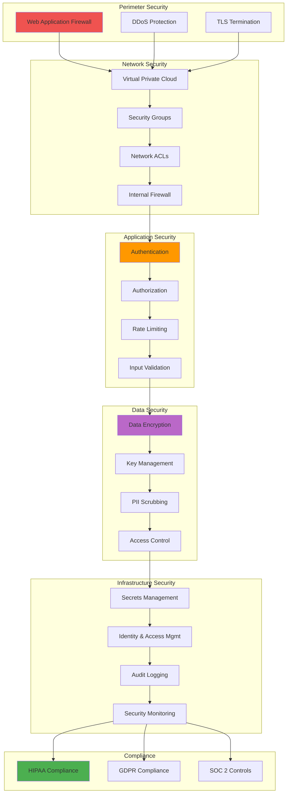
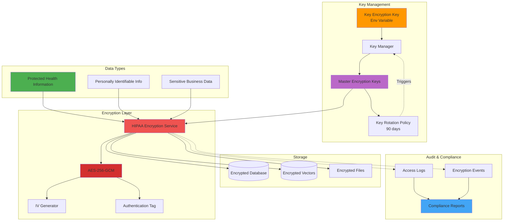
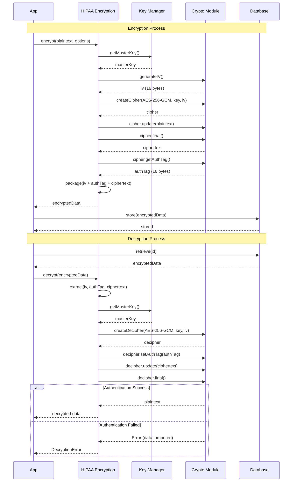
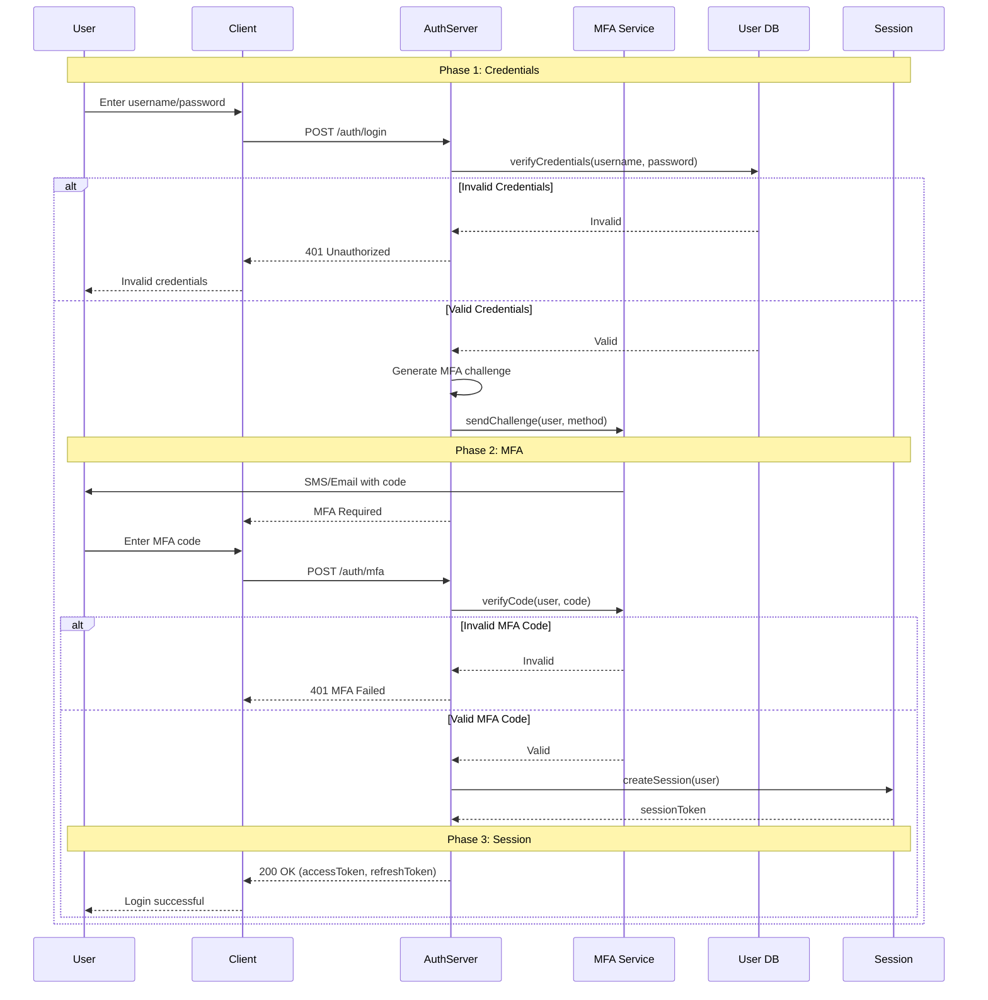
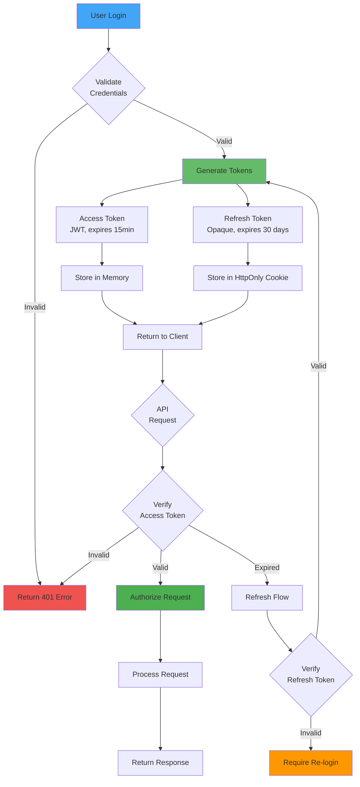
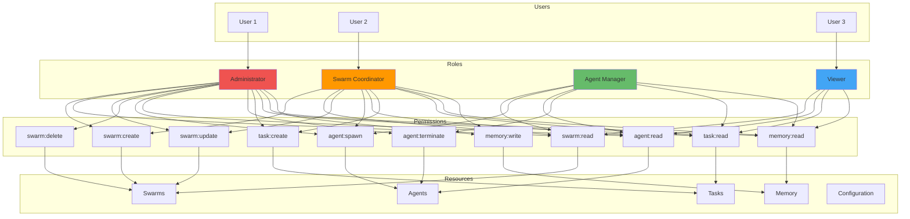
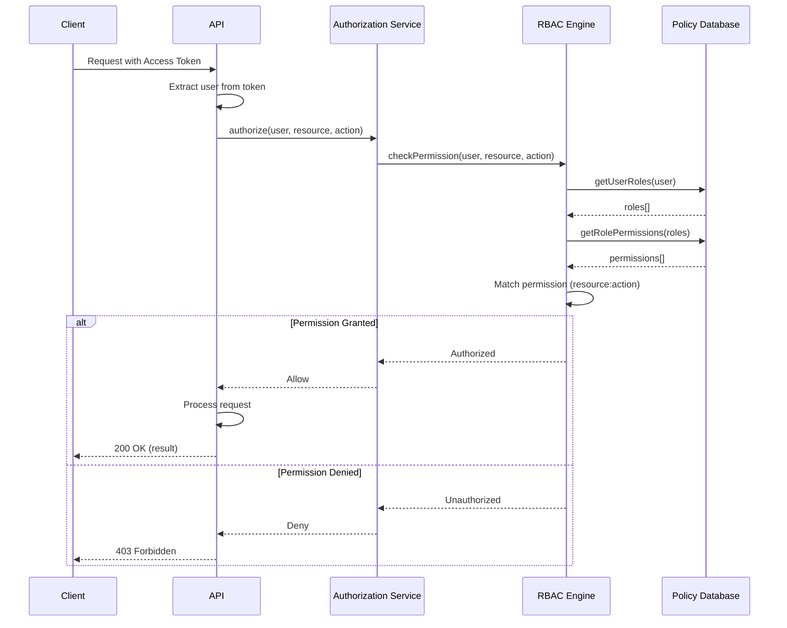
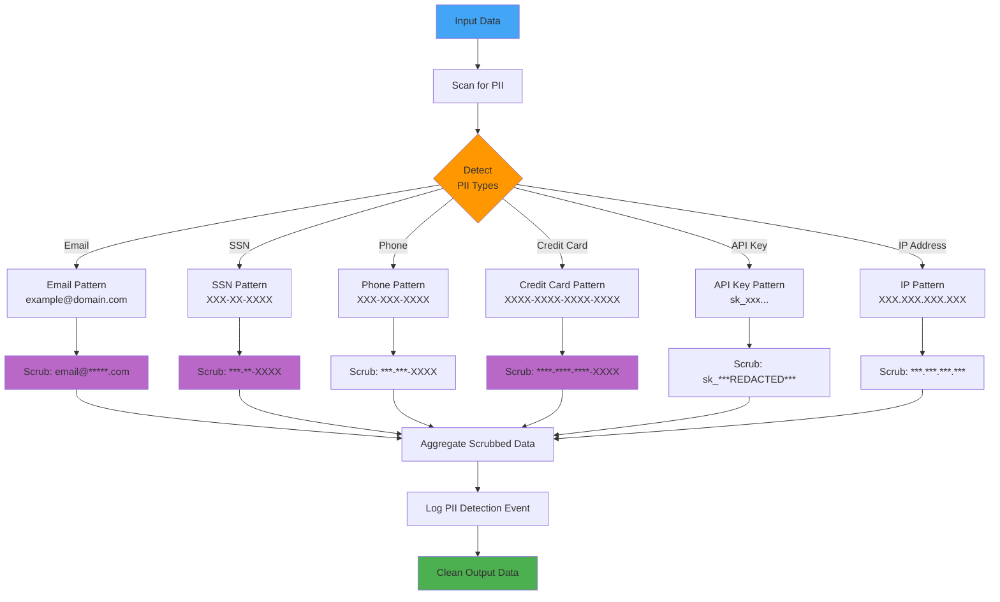
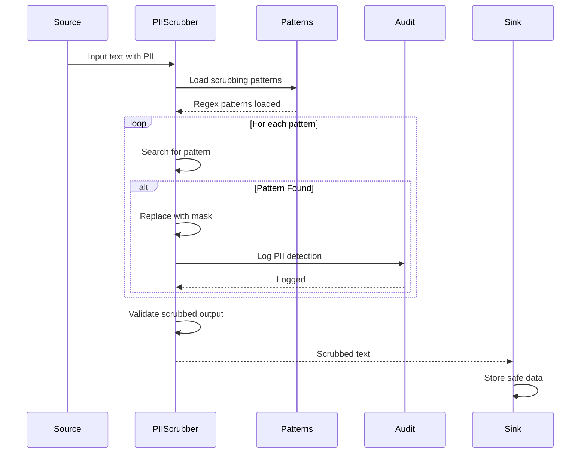
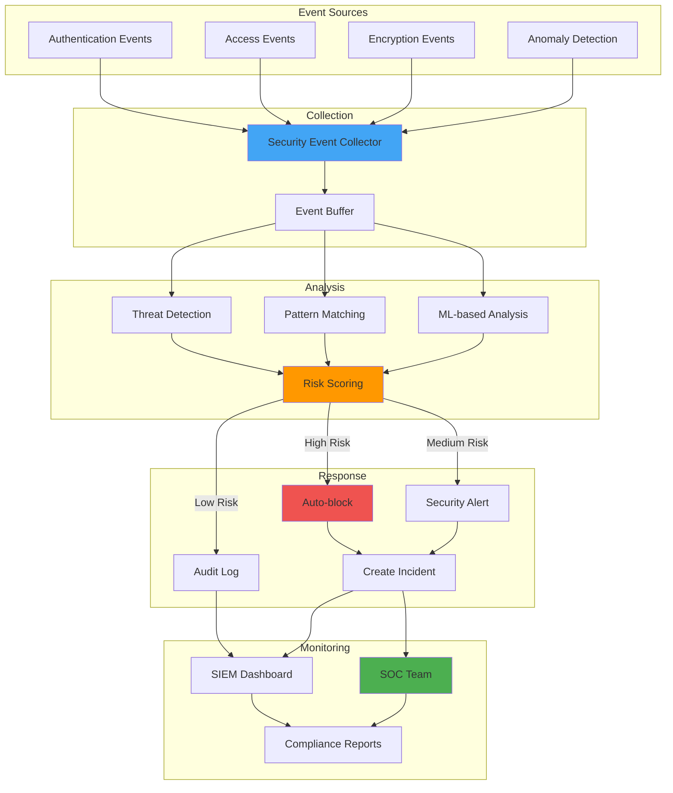

# Security Architecture

Comprehensive security diagrams showing encryption, authentication, authorization, and compliance patterns.

## Table of Contents

1. [Security Layers](#security-layers)
2. [HIPAA Encryption](#hipaa-encryption)
3. [Authentication Flow](#authentication-flow)
4. [Authorization Model](#authorization-model)
5. [PII Scrubbing](#pii-scrubbing)
6. [Security Monitoring](#security-monitoring)

---

## Security Layers

### Defense in Depth

---

## HIPAA Encryption

### Encryption Architecture

### Encryption/Decryption Flow

---

## Authentication Flow

### Multi-Factor Authentication

### Token-Based Authentication

---

## Authorization Model

### Role-Based Access Control (RBAC)

### Permission Check Flow

---

## PII Scrubbing

### PII Detection and Scrubbing

### PII Scrubbing Pipeline

---

## Security Monitoring

### Security Event Pipeline

---

## Related Documentation

- [System Architecture](./SYSTEM_ARCHITECTURE.md) - Overall system design
- [Deployment](./DEPLOYMENT.md) - Infrastructure security
- [Error Handling](./ERROR_HANDLING.md) - Security error flows
- [Data Flow](./DATA_FLOW.md) - Encrypted data flows
- [Agent Lifecycle](./AGENT_LIFECYCLE.md) - Secure agent management

---

**Last Updated**: 2025-12-08
**Diagram Count**: 9 interactive Mermaid.js diagrams
