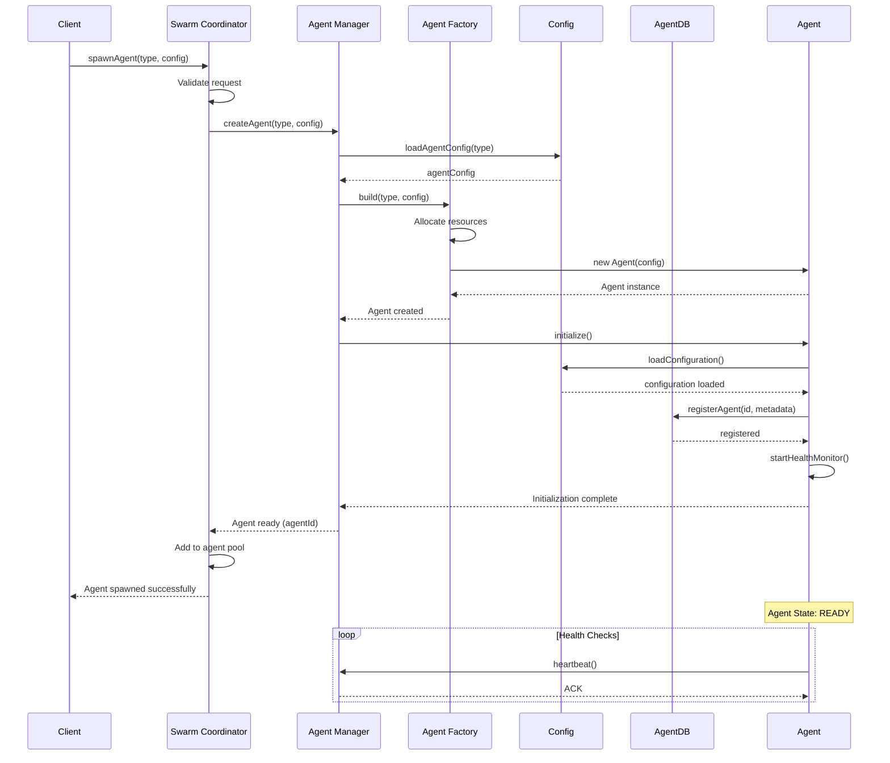
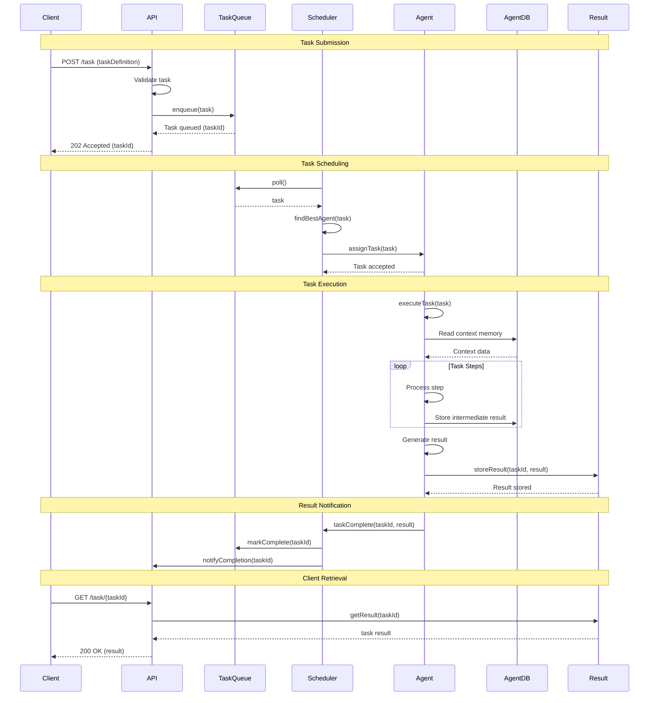
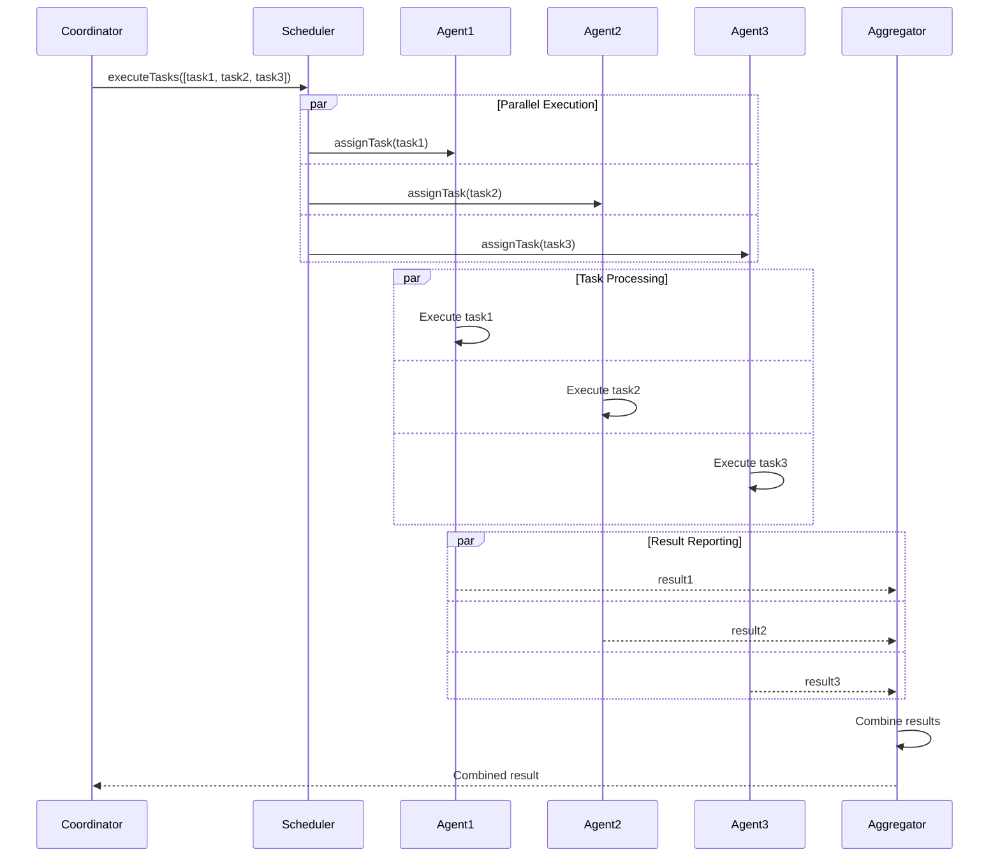
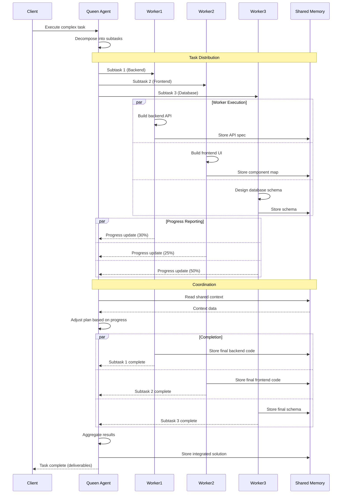
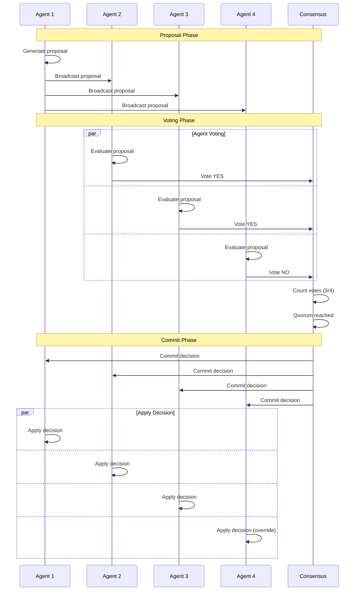
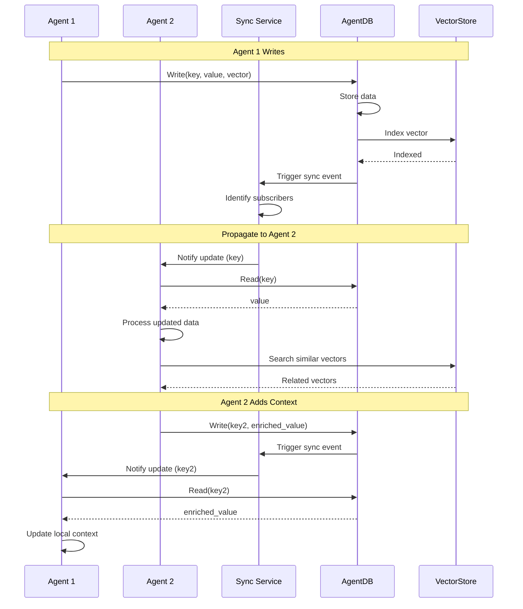
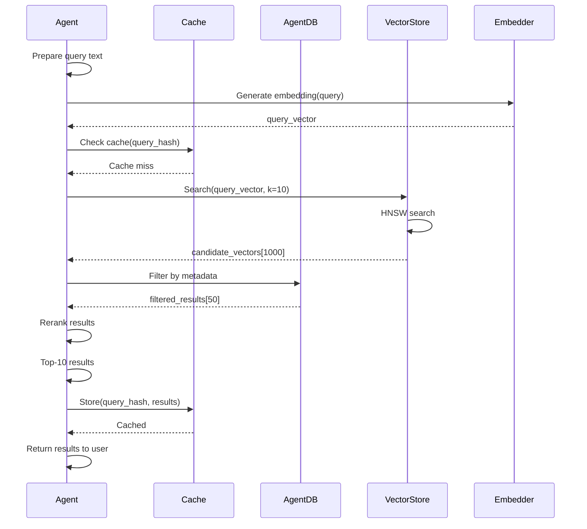
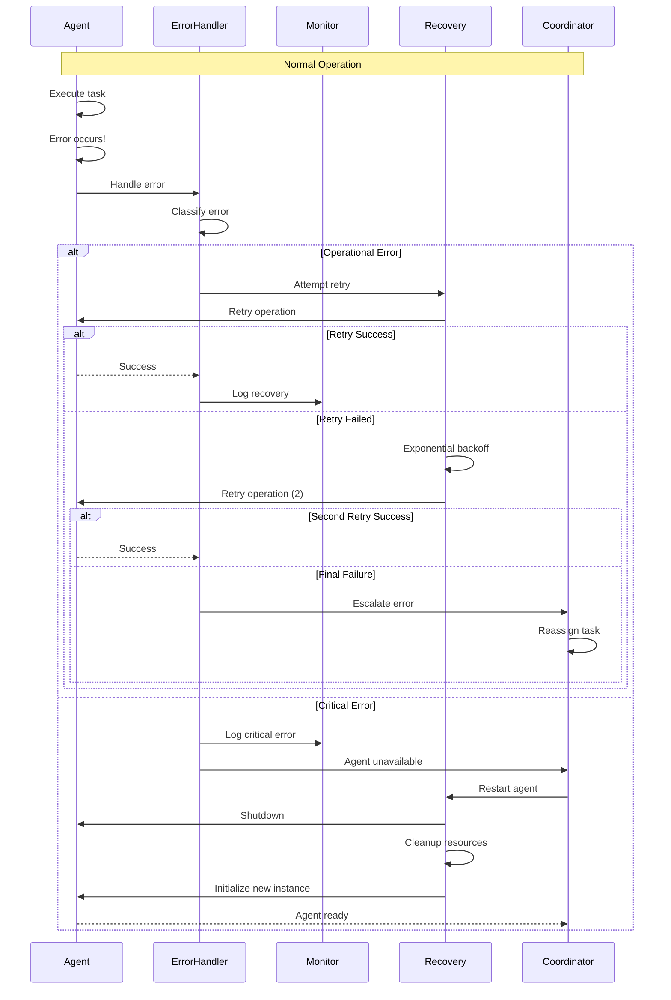
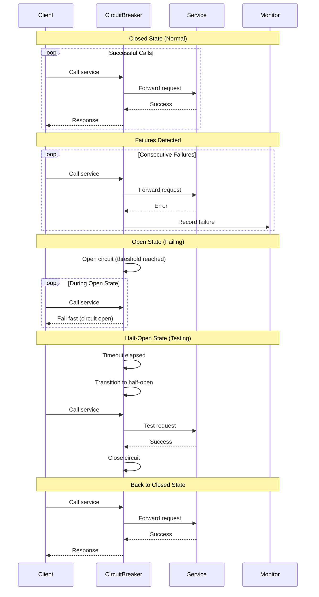
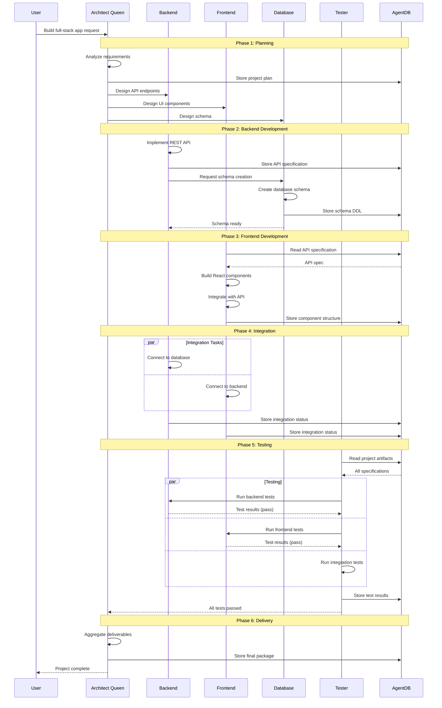

# Sequence Diagrams

Detailed sequence diagrams showing key workflows and interactions in the agent-control-plane system.

## Table of Contents

1. [Agent Creation Flow](#agent-creation-flow)
2. [Task Execution Workflow](#task-execution-workflow)
3. [Swarm Coordination](#swarm-coordination)
4. [Memory Synchronization](#memory-synchronization)
5. [Error Handling and Recovery](#error-handling-and-recovery)
6. [Full-Stack Development Workflow](#full-stack-development-workflow)

---

## Agent Creation Flow

### Complete Agent Spawning Sequence

---

## Task Execution Workflow

### End-to-End Task Processing

### Parallel Task Execution

---

## Swarm Coordination

### Hierarchical Swarm Workflow

### Mesh Network Coordination

---

## Memory Synchronization

### Cross-Agent Memory Sync

### Vector Search with Memory

---

## Error Handling and Recovery

### Error Detection and Recovery Flow

### Circuit Breaker Pattern

---

## Full-Stack Development Workflow

### Complete Development Cycle

---

## Related Documentation

- [System Architecture](./SYSTEM_ARCHITECTURE.md) - Overall system design
- [Swarm Coordination](./SWARM_COORDINATION.md) - Coordination patterns
- [Agent Lifecycle](./AGENT_LIFECYCLE.md) - Agent states
- [Data Flow](./DATA_FLOW.md) - Data movement
- [Error Handling](./ERROR_HANDLING.md) - Error flows
- [Deployment](./DEPLOYMENT.md) - Infrastructure

---

**Last Updated**: 2025-12-08
**Diagram Count**: 10 interactive sequence diagrams
