# Swarm Coordination Architecture

Interactive diagrams showing swarm topologies, coordination patterns, and communication flows.

## Table of Contents

1. [Swarm Topologies](#swarm-topologies)
2. [Hierarchical Coordination](#hierarchical-coordination)
3. [Mesh Coordination](#mesh-coordination)
4. [Adaptive Coordination](#adaptive-coordination)
5. [Consensus Mechanisms](#consensus-mechanisms)
6. [Communication Patterns](#communication-patterns)

---

## Swarm Topologies

### Topology Overview

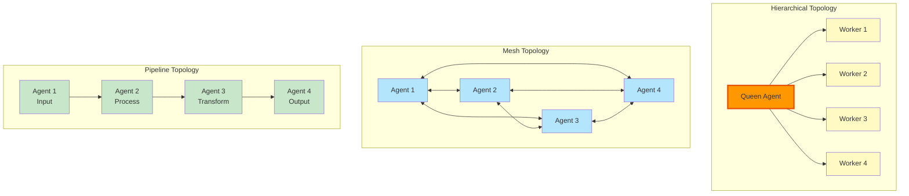

---

## Hierarchical Coordination

### Queen-Worker Pattern

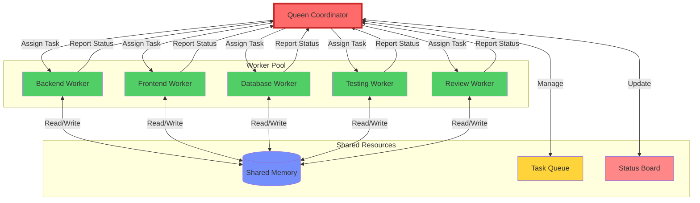

### Task Distribution Flow

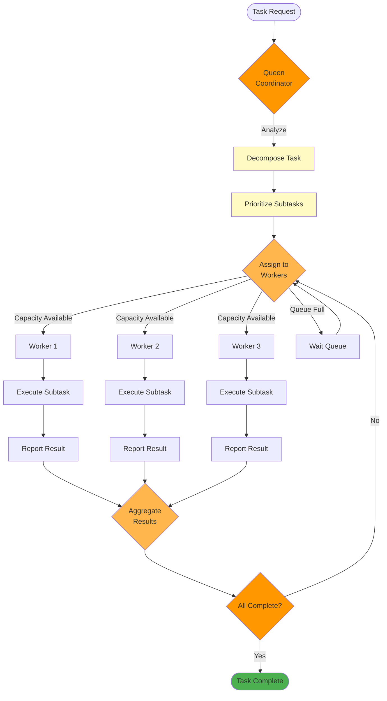

---

## Mesh Coordination

### Peer-to-Peer Communication

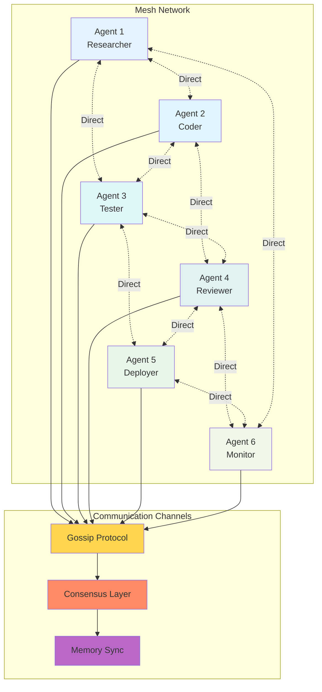

### Gossip Protocol Flow

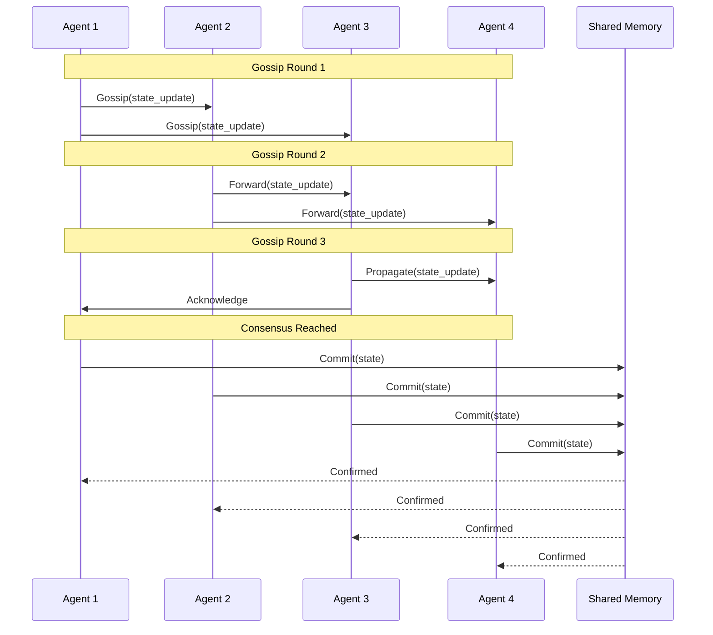

---

## Adaptive Coordination

### Dynamic Topology Adjustment

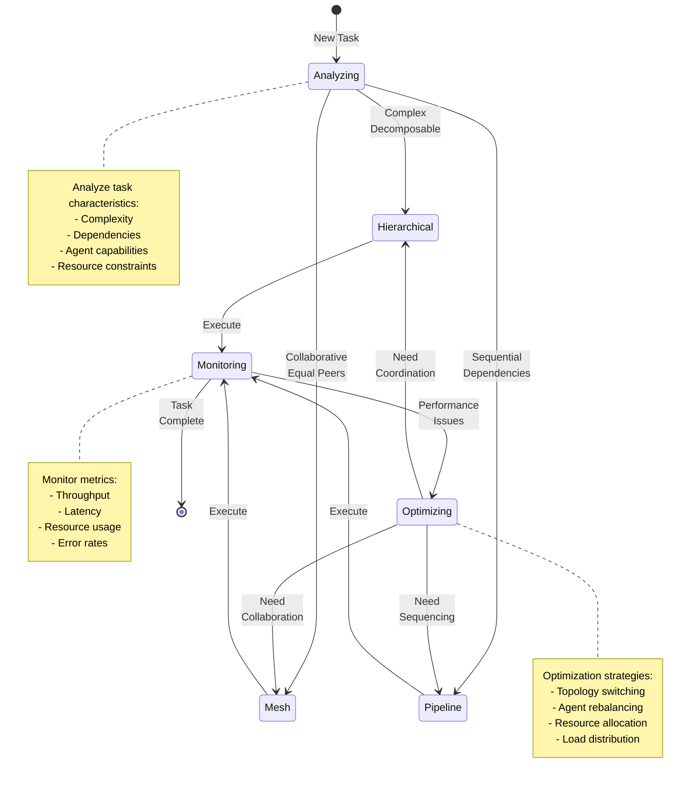

### Load Balancing

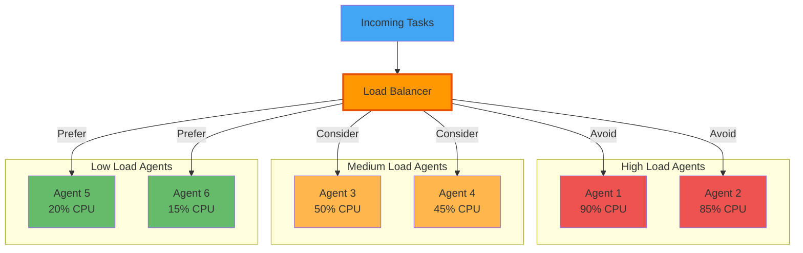

---

## Consensus Mechanisms

### Byzantine Fault Tolerance

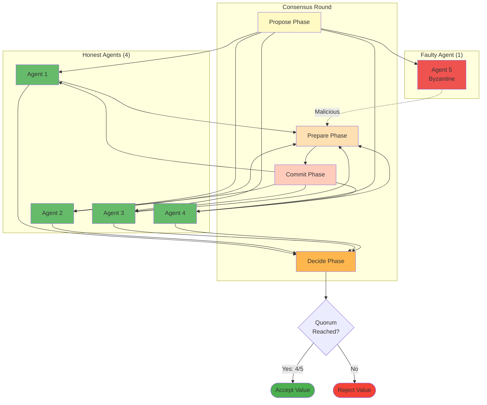

### Raft Consensus

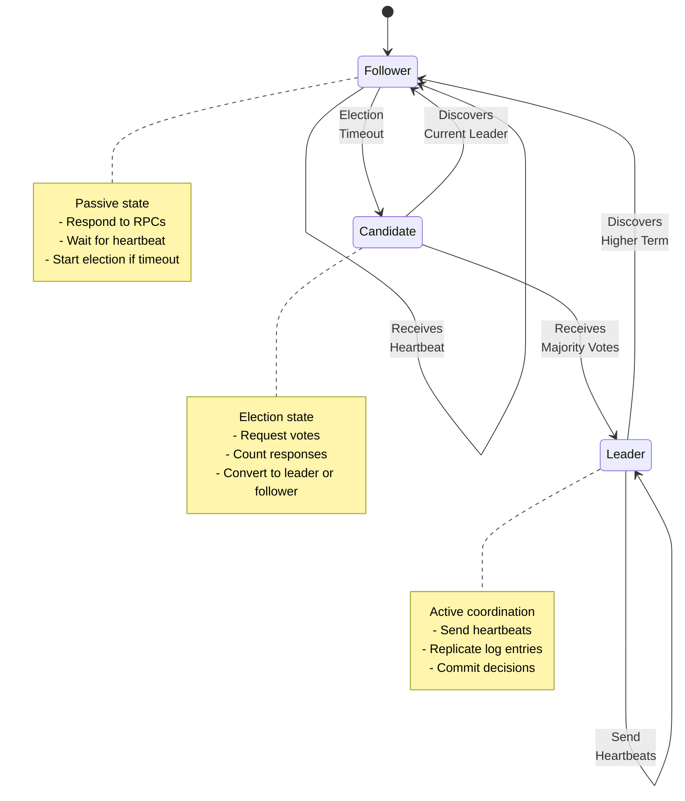

---

## Communication Patterns

### Message Flow Patterns

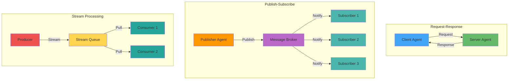

### Memory Synchronization

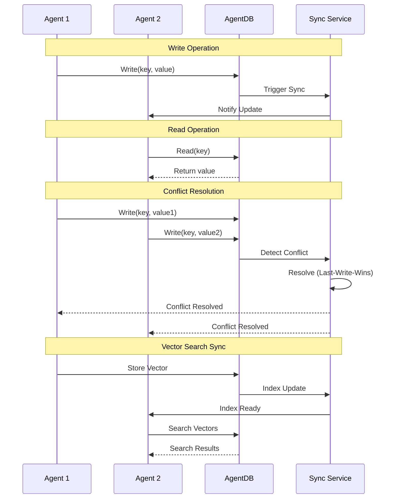

---

## Coordination Metrics

### Performance Dashboard

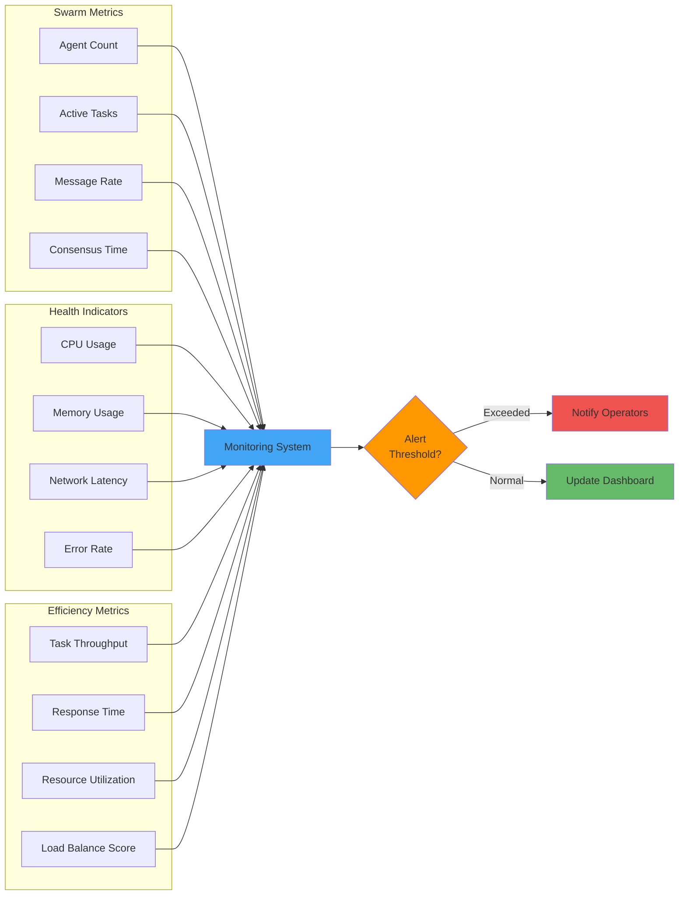

---

## Related Documentation

- [System Architecture](./SYSTEM_ARCHITECTURE.md) - Overall system design
- [Agent Lifecycle](./AGENT_LIFECYCLE.md) - Agent state management
- [Data Flow](./DATA_FLOW.md) - Data movement patterns
- [Sequences](./SEQUENCES.md) - Detailed sequence diagrams
- [Error Handling](./ERROR_HANDLING.md) - Error coordination

---

**Last Updated**: 2025-12-08
**Diagram Count**: 11 interactive Mermaid.js diagrams
