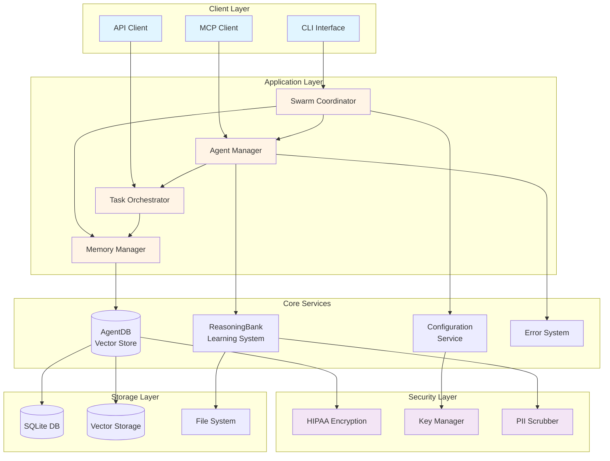
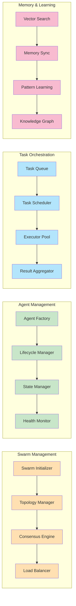
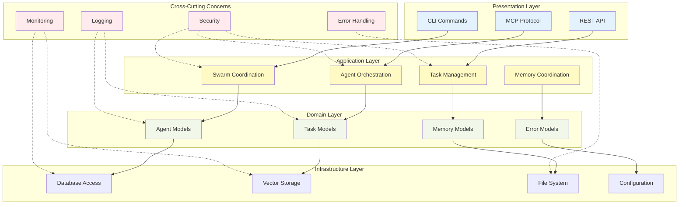
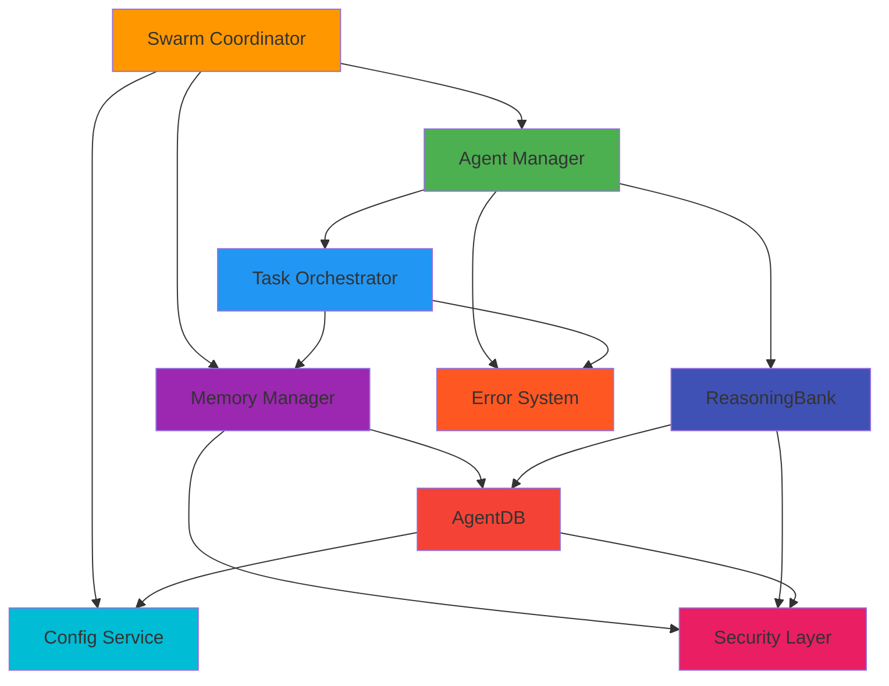
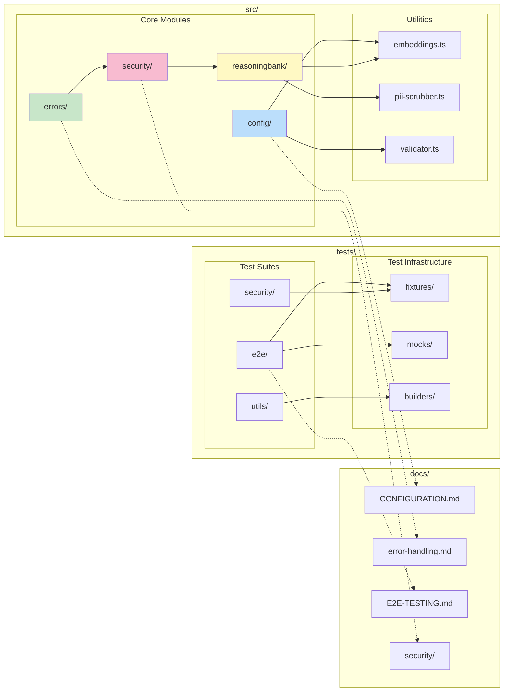

# System Architecture

Interactive Mermaid.js diagrams visualizing the agent-control-plane system architecture.

## Table of Contents

1. [High-Level System Overview](#high-level-system-overview)
2. [Core Components](#core-components)
3. [Layer Architecture](#layer-architecture)
4. [Integration Points](#integration-points)
5. [Component Dependencies](#component-dependencies)

---

## High-Level System Overview

---

## Core Components

### Component Breakdown

---

## Layer Architecture

### Architectural Layers

---

## Integration Points

### External Integrations

```mermaid
graph TB
    subgraph "Agentic Flow System"
        CORE[Core System]
    end

    subgraph "MCP Ecosystem"
        MCP_SERVER[MCP Server]
        MCP_TOOLS[MCP Tools]
        MCP_HOOKS[Hooks System]
    end

    subgraph "AI Providers"
        OPENAI[OpenAI API]
        ANTHROPIC[Anthropic API]
        LOCAL_LLM[Local LLM]
    end

    subgraph "Storage Systems"
        SQLITE_DB[(SQLite)]
        VECTOR_DB[(Vector DB)]
        FILE_STORE[File Storage]
    end

    subgraph "Monitoring & Analytics"
        METRICS[Metrics System]
        LOGS[Log Aggregator]
        TRACES[Trace Collector]
    end

    subgraph "Security Services"
        KEY_VAULT[Key Vault]
        AUDIT_LOG[Audit Logger]
        ENCRYPTION[Encryption Service]
    end

    CORE <--> MCP_SERVER
    CORE <--> MCP_TOOLS
    CORE <--> MCP_HOOKS

    CORE --> OPENAI
    CORE --> ANTHROPIC
    CORE --> LOCAL_LLM

    CORE <--> SQLITE_DB
    CORE <--> VECTOR_DB
    CORE <--> FILE_STORE

    CORE --> METRICS
    CORE --> LOGS
    CORE --> TRACES

    CORE <--> KEY_VAULT
    CORE --> AUDIT_LOG
    CORE <--> ENCRYPTION

    style CORE fill:#ffd54f
    style MCP_SERVER fill:#81c784
    style MCP_TOOLS fill:#81c784
    style MCP_HOOKS fill:#81c784
    style OPENAI fill:#64b5f6
    style ANTHROPIC fill:#64b5f6
    style LOCAL_LLM fill:#64b5f6
    style ENCRYPTION fill:#ef5350
    style KEY_VAULT fill:#ef5350
    style AUDIT_LOG fill:#ef5350
```

---

## Component Dependencies

### Dependency Graph

---

## Module Organization

---

## Technology Stack

```mermaid
graph TB
    subgraph "Runtime"
        NODEJS[Node.js 18/20/22]
        TS[TypeScript 5.x]
    end

    subgraph "Core Libraries"
        SQLITE[better-sqlite3]
        CRYPTO[Node Crypto]
        ONNX[ONNX Runtime]
    end

    subgraph "Testing"
        JEST[Jest]
        PLAYWRIGHT[Playwright]
        MOCK[Mock Servers]
    end

    subgraph "Tools"
        ESLINT[ESLint]
        PRETTIER[Prettier]
        DOCKER[Docker]
    end

    subgraph "Protocols"
        MCP[MCP Protocol]
        QUIC[QUIC Transport]
        HTTP[HTTP/REST]
    end

    NODEJS --> TS
    TS --> SQLITE
    TS --> CRYPTO
    TS --> ONNX

    JEST --> MOCK
    PLAYWRIGHT --> MOCK

    ESLINT --> TS
    PRETTIER --> TS

    MCP --> NODEJS
    QUIC --> NODEJS
    HTTP --> NODEJS

    style NODEJS fill:#68a063
    style TS fill:#3178c6
    style SQLITE fill:#003b57
    style CRYPTO fill:#ff6b6b
    style MCP fill:#ffd93d
    style JEST fill:#c21325
    style PLAYWRIGHT fill:#2ead33
```

---

## Related Documentation

- [Swarm Coordination](./SWARM_COORDINATION.md) - Topology and coordination patterns
- [Agent Lifecycle](./AGENT_LIFECYCLE.md) - Agent states and transitions
- [Data Flow](./DATA_FLOW.md) - Request/response flows
- [Deployment](./DEPLOYMENT.md) - Infrastructure architecture
- [Sequences](./SEQUENCES.md) - Sequence diagrams
- [Error Handling](./ERROR_HANDLING.md) - Error flow diagrams
- [Security](./SECURITY.md) - Security architecture

---

**Last Updated**: 2025-12-08
**Diagram Count**: 8 interactive Mermaid.js diagrams
